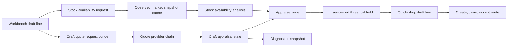

# CA Appraisal Workbench Reintegration

## Status

Draft for review, written on 2026-07-06.

This supersedes the earlier idea of keeping a standalone Craft Architect Companion surface as an advanced or diagnostic fallback. The service code remains valuable. The separate user-facing tab and popout do not.

## Decision

Move Craft Architect craft-cost appraisal into the Acquisition Workbench and remove the standalone CA Companion tab/window from the normal plugin surface.

The resulting ownership is:

- `Acquisition Workbench`: the user journey for appraisal, threshold choice, stock comparison, sync, preparation, route execution, adjustment, and recovery.
- `Diagnostics`: operational visibility for quote providers, Workshop Host capability checks, quote failures, cache state, diagnostic printout paths, and market-depth telemetry.
- `CraftArchitectCompanion` service namespace: internal quote/appraisal integration layer, not a top-level product surface.

## Current Source Shape

The current code already has most of the needed pieces, but they are arranged as scattered windows:

- `src/MarketMafioso/Windows/MainWindow.cs` adds a `CA Companion` tab, creates `CraftArchitectCompanionWindow`, and exposes companion settings.
- `src/MarketMafioso/Plugin.cs` registers `mainWindow.CraftArchitectCompanion` with the Dalamud window system.
- `src/MarketMafioso/Windows/CraftArchitectCompanionWindow.cs` owns the existing quote UI, Workshop Host quote controls, manual/file fallback controls, market-depth comparison, and quick-shop handoff.
- `src/MarketMafioso/Windows/AcquisitionWorkbenchWindow.cs` already owns the route draft, selected-line stock check, route sync, route preparation, route execution, and recovery panes.
- `src/MarketMafioso/Windows/MarketAcquisitionDiagnosticsWindow.cs` already owns deep Market Acquisition diagnostics and can absorb CA quote provider diagnostics.
- `src/MarketMafioso/CraftArchitectCompanion/*` contains reusable services and presenters that should survive the UI consolidation.

## Problem

The standalone CA Companion tab creates a second place to do almost the same acquisition thinking:

- It asks for an item, quantity, HQ policy, route scope, buy threshold, and gil cap even though the workbench already owns acquisition lines.
- It can create quick-shop routes, but that duplicates the workbench route creation path.
- It exposes provider diagnostics and diagnostic printout paths even though the plugin already has a Diagnostics tab.
- It risks implying that the Craft Architect quote is an authoritative acquisition threshold instead of advisory evidence.

The issue is not that the CA Companion code is bad. It is that the user-facing boundary is wrong.

## Product Principle

Craft Architect cost is evidence inside acquisition, not a separate workflow.

The user should be able to:

1. Add one or more acquisition lines in the workbench.
2. Select a line.
3. Request a Craft Architect quote for that line.
4. See quote source, completeness, freshness, material warnings, and estimated unit cost.
5. Compare that advisory cost against under-threshold market stock for the current line.
6. Explicitly decide the line's acquisition threshold.
7. Sync, prepare, run, adjust, and recover the route without opening any other product tab.

## Non-Goals

- Do not make Craft Architect estimated cost authoritative.
- Do not remove the quote provider service code.
- Do not remove manual/file quote fallback support from the code path.
- Do not require the dashboard to claim, accept, or start client-authored routes.
- Do not add a new quote lifecycle to the server in this plugin-side integration slice.
- Do not broaden the Diagnostics tab into a second workbench.

## User-Facing Surface Changes

### Main Window

Remove the top-level `CA Companion` tab.

The `Market Acquisition` tab remains a compact launcher/status surface:

- active route status;
- draft line count;
- last synced request status;
- buttons for `Open Acquisition Workbench` and `Open Diagnostics`.

The `Overview` module list should not advertise Craft Architect Companion as a standalone module. A better summary is that Market Acquisition supports optional Craft Architect quote evidence when configured.

### Acquisition Workbench

The workbench keeps its three-column structure:

- left: route/draft line editing;
- center: active pane;
- right: selected-line details and sync state.

The `Appraise` pane becomes the home for Craft Architect evidence. It should combine:

- selected acquisition line;
- quote controls;
- quote result;
- material/diagnostic detail;
- editable threshold;
- stock availability under the currently set threshold;
- actions to apply a quote into the threshold field.

The existing stock availability panel stays route-line based. It should be extended rather than replaced.

### Diagnostics

Diagnostics gets CA quote operational information:

- Workshop Host quote API enabled/disabled;
- last capability check time and result;
- last quote request item/quantity/HQ/region;
- last quote provider result or failure;
- last-good cache hit/miss state;
- quote diagnostic printout path;
- market-depth diagnostic printout path;
- stale or incomplete quote warnings.

Diagnostics should not ask the user to build a route or set thresholds.

### Settings

Settings keeps provider configuration:

- enable Workshop Host craft quotes;
- enable manual craft-cost fallback;
- quote file path if file fallback remains user-configurable;
- optional API-key/server fields that already live in the shared settings area.

These are configuration controls, not route workflow controls.

## Appraise Pane Design

### Selected Line Header

The top of the pane identifies the selected workbench line:

- item name and inferred item ID;
- requested quantity or `Buy all below threshold`;
- HQ policy;
- region/scope;
- current max unit price;
- gil cap when set.

If no line is selected, the pane shows a compact empty state and does not expose quote buttons.

### Quote Evidence Block

The quote evidence block shows:

- source: Workshop Host, quote file, manual, or last-good;
- estimated unit cost;
- completeness;
- freshness;
- short warning text when the quote is incomplete, stale, unavailable, or fallback-derived;
- material summary and expandable calculation details.

Primary actions:

- `Fetch Craft Quote`
- `Use Craft Cost As Threshold`
- `Clear Quote Evidence`

There are no percentage adjustment buttons. Arbitrary threshold changes happen by editing the line threshold itself.

### Threshold And Stock Block

The line's max unit price remains the acquisition threshold. It is always editable.

When the threshold changes:

- the quote remains visible because the craft cost did not change;
- stock availability analysis is invalidated;
- cached raw market observations may be reused if item and scope did not change.

Stock availability counts only stock at or below the current threshold. Above-threshold listings can appear in diagnostic/detail views, but they must not be counted as route-available stock.

For `TargetQuantity`, stock availability can say whether the current scope appears to satisfy the target.

For `AllBelowThreshold` without a cap, stock availability reports depth instead of sufficiency:

- eligible units observed;
- eligible listing count;
- world count;
- lowest/highest eligible unit price;
- observed total gil at the threshold.

It must not say `enough`, `short`, or similar because there is no required quantity to compare against.

### Multi-Line Behavior

The first implementation should quote one selected line at a time. The workbench must still support multi-line acquisition drafts. The right-pane selected-line summary should make it obvious which line the quote belongs to.

Bulk quote refresh can be added later if the one-line path proves useful and the Workshop Host quote API load profile is acceptable.

## Service Boundary

Keep the existing `MarketMafioso.CraftArchitectCompanion` namespace as the integration layer:

- `ICraftQuoteProvider`
- `WorkshopHostCraftQuoteProvider`
- `WorkshopHostCapabilitiesClient`
- `CompositeCraftQuoteProvider`
- `LastGoodCraftQuoteProvider`
- `ManualCraftQuoteProvider`
- `CraftArchitectFileQuoteProvider`
- `CraftArchitectMarketAppraisalService`
- `CraftQuoteDisplayFormatter`
- diagnostic printout builders
- quick-shop draft builder only if still needed during migration

Move ImGui workflow orchestration out of `CraftArchitectCompanionWindow` into smaller workbench-oriented units.

Recommended new workbench units:

- `CraftAppraisalWorkbenchState`: selected-line quote request, latest quote, statuses, diagnostic paths, and capability state.
- `CraftAppraisalWorkbenchController`: async fetch/capability/clear/apply operations.
- `CraftAppraisalPanel`: ImGui drawing for the Appraise pane quote block.
- `CraftAppraisalDiagnosticsSnapshot`: immutable status object consumed by Diagnostics.

These units should depend on quote providers and workbench line state, not on `CraftArchitectCompanionWindow`.

## Data Flow

Important rule: the arrow from quote evidence to threshold is always an explicit user action.

## Error Handling

Quote provider failures are visible provider failures.

- Workshop Host capability missing: show unavailable status and skip Workshop Host quote action.
- Workshop Host quote request fails: show failure in Appraise and Diagnostics; do not silently substitute a stale value unless the value is labeled last-good.
- Quote file missing or invalid: show fallback failure where fallback controls live.
- Manual fallback disabled: do not show manual cost input in the normal Appraise pane.
- Manual fallback enabled: label it as local troubleshooting evidence.
- Quote incomplete: allow the user to view details and manually choose a threshold, but do not make the quote look definitive.
- Stock fetch unavailable: keep quote evidence visible, keep draft editable, and require a successful plan/probe before claiming stock exists.

## Removal Criteria For The Standalone Window

The standalone `CraftArchitectCompanionWindow` can be removed when all of these are true:

- Acquisition Workbench can fetch and display a quote for the selected line.
- Acquisition Workbench can apply quote cost to the selected line threshold with an explicit action.
- Acquisition Workbench can compare current threshold against stock availability for that same selected line.
- Diagnostics can show quote provider/capability/status/printout information.
- Settings still expose provider configuration.
- Tests cover quote display, quote apply, diagnostics snapshot, and removal from window registration.

After that point:

- remove the `CA Companion` tab from `MainWindow`;
- remove `CraftArchitectCompanionWindow` registration from `Plugin`;
- delete `CraftArchitectCompanionWindow.cs` if no longer referenced;
- keep and retarget service/presenter tests.

## Testing Requirements

Automated tests should cover:

- quote request builder maps selected workbench lines into `MarketAppraisalRequest`;
- quote evidence is tied to the selected line and invalidates when item, quantity, HQ policy, or scope changes;
- quote evidence does not overwrite max unit price without `Use Craft Cost As Threshold`;
- applying quote cost mutates only the selected line threshold;
- changing threshold invalidates stock analysis but not quote evidence;
- stock availability counts only under-threshold listings;
- uncapped `AllBelowThreshold` reports depth rather than sufficiency;
- diagnostics snapshot exposes provider status, capability status, last quote status, and printout paths;
- `MainWindow` no longer draws or advertises a `CA Companion` tab;
- `Plugin` no longer registers a standalone companion window.

Manual verification should cover:

- one selected line quoted from Workshop Host;
- one selected line using manual fallback only when enabled;
- a multi-line draft where only one line has quote evidence;
- applying craft cost to threshold, then editing threshold manually;
- stock availability refresh after threshold change;
- diagnostics showing the quote failure path when Workshop Host is unavailable;
- no route workflow requires opening a separate CA Companion surface.

## Open Implementation Notes

- Prefer moving logic out of `CraftArchitectCompanionWindow` before deleting it, so tests can follow the behavior instead of the window.
- The existing `CraftAppraisalPanelPresenter` should be reused or adapted if its output still matches the new workbench pane.
- If `CraftArchitectQuickShopRouteService` becomes unused after integration, retire it after the workbench route creation path is proven to cover the same route creation behavior.
- Keep naming user-facing: `Craft Cost`, `Craft Quote`, or `Appraisal` are clearer than `CA Companion` in the acquisition workflow.
