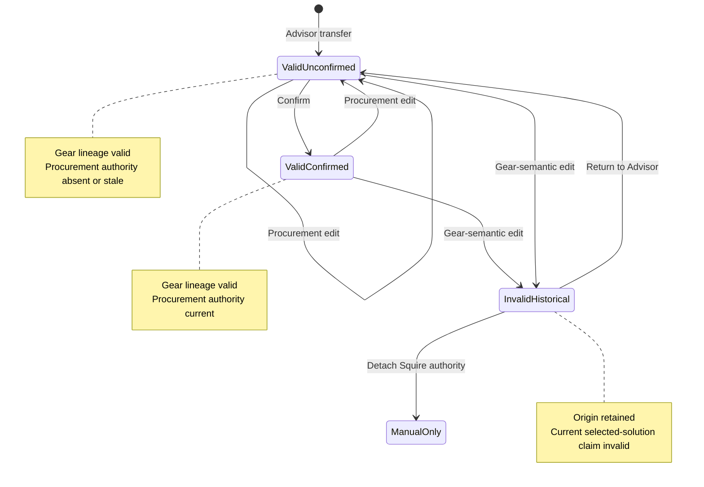
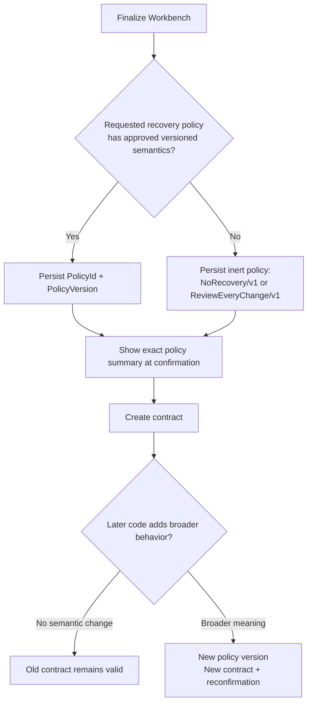
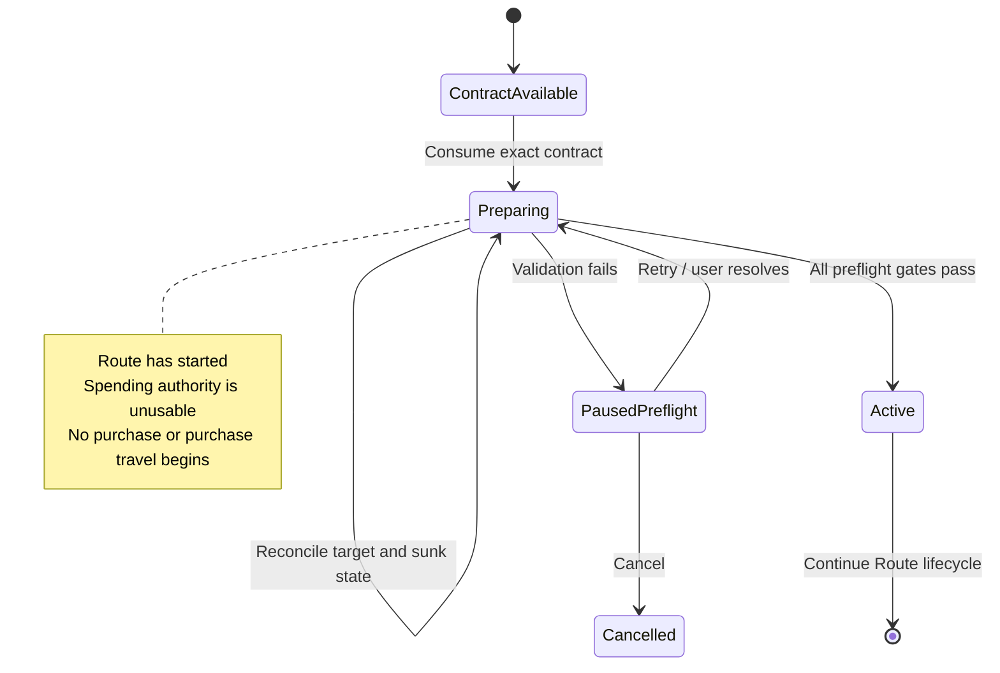

# Squire Outfitter M8 and M8.5 visual policy review — revision 2

Source task: `019f64f7-37e3-7b13-adfe-38ac35c188b1`

Status: Review only. No policy, code, persistence, or Route authority is approved.

## Full task response
# Review Artifact: Squire Outfitter M8 + M8.5 Execution Policy

**Audience:** Fran  
**Artifact type:** Product-policy review handoff  
**Revision:** 2 — seam, preflight, and versioned recovery-authority corrections  
**Status:** Decisions required; silence grants no approval  
**Implementation status:** Paused  
**Code authority:** None. This document changes review structure only.

> [!abstract] Navigation
> [[#1. Executive map|Overview]] · [[#2. The ownership seam|M8 seam]] · [[#8. M8 decisions: pre-Route authority|M8 decisions]] · [[#9. M8.5 lifecycle: contract consumption to active Route|M8.5 decisions]] · [[#17. Coherent bundles|Bundles]] · [[#18. Decision dependencies and blockers|Dependencies]] · [[#19. Reversibility and migration cost|Migration]] · [[#21. Decision worksheet for Fran|Worksheet]]

---

## 1. Executive map

### M8 pre-Route overview

![[diagrams/m8-pre-route-overview.svg|900]]

*[[diagrams/m8-pre-route-overview.mmd|Editable Mermaid source]]*

### M8.5 Route lifecycle overview

#### Route start and preflight

![[diagrams/m8-5-route-start-overview.svg|800]]

*[[diagrams/m8-5-route-start-overview.mmd|Editable Mermaid source]]*

#### Active purchase and recovery loop

![[diagrams/m8-5-active-route-overview.svg|800]]

*[[diagrams/m8-5-active-route-overview.mmd|Editable Mermaid source]]*

### Corrected lifecycle rule

> **Route begins when it consumes one finalized execution contract in a Route-start handshake. It then enters `Preparing`, where no purchase authority may be exercised. M8.5 preflight happens after this handshake and must succeed before Route can travel for or purchase Squire work.**

This keeps Fran’s seam precise:

- M8 ends after creating a finalized execution contract.
- M8.5 begins when Route consumes that contract.
- Preflight belongs to M8.5 because it evaluates the execution environment for an already-started Route.
- Preflight is not permission to buy; it is a gate before spending authority becomes usable.

A market refresh performed while editing or finalizing Workbench remains an M8 readiness aid. It may update the proposed expected cost or warn that the draft is stale, but it does not replace M8.5 preflight or immediate UI revalidation.

---

## 2. The ownership seam

> [!important] M8/M8.5 ownership seam
> M8 produces a finalized, versioned, inspectable execution contract. M8.5 defines what Route may do when live reality diverges from that contract after Route consumes it.

| Concern | M8: before Route starts | M8.5: after contract consumption |
|---|---|---|
| Gear choice | Preserve the user-selected Advisor solution | Never change it silently |
| Workbench | Persist and directly edit acquisition intent | Treat finalized revision as immutable |
| Price authority | Define visible line and total caps | Consume remaining authority after purchases |
| Recovery policy | Record only an approved, versioned policy identifier | Apply exactly those versioned semantics |
| Unapproved recovery semantics | Persist inert `NoRecovery` or `ReviewEveryChange` authority | Cannot be activated through later defaults |
| Draft evidence refresh | Help the user review current expected cost before finalization | Does not authorize purchases |
| Route-start handshake | Not yet started | Consume exact contract and enter `Preparing` |
| Preflight | Not applicable | Refresh/reconcile after Route starts, before spending |
| Market rows | Preserve planning lineage and expected rows | Revalidate visible rows immediately before spending |
| Listing changes | May preview drift before finalization | Classify and handle actual changed/missing rows |
| Route shape | Record allowed worlds and preferences | Reorder remaining visits only if policy permits |
| Partial purchases | Not yet applicable | Treat purchased quantity and spent gil as sunk state |
| Lineage edits | Decide whether Workbench still represents the solution | Procurement recovery preserves gear lineage |
| Restart/resume | Persist contract and confirmation identity | Reconcile and resume, pause, or expire |

---

# 3. Fixed invariants

> [!warning] Fixed authority boundaries
> These are roadmap constraints, not options in this review.

| Invariant | Why it exists | Consequence |
|---|---|---|
| Decision-critical live state comes from automated UI | Aggregator data and structs cannot prove the visible row or purchase result | Every purchase requires UI-observed identity and result |
| Game structs do not authorize baselines, listings, purchases, or outcomes | Struct state may be stale or semantically ambiguous | A failed UI observation cannot be bypassed |
| NQ and HQ are separate offer identities | Quality changes stats, utility, and value | Squire never stages `Either` |
| Advisor nomination is not purchase authority | The user may choose another frontier point | The user-selected solution enters Workbench |
| Workbench is the sole editable local composition | Duplicate editors drift and confuse ownership | No Squire request form or staging pane |
| Route executes finalized work | Draft edits cannot alter active authority | Route consumes one exact finalized revision |
| A different item, quality, or required quantity may change utility | Procurement recovery must not become hidden gear advice | Such changes return to Advisor unless explicitly approved later |
| Non-gil procurement is unsupported | The system does not acquire currency-gated equipment | Supported solutions use owned, gil-vendor, or market sources |
| Authority must be visible at confirmation | Hidden fields and future defaults are not informed consent | Route may exercise only the envelope and policy shown to the user |
| Policy meaning is immutable by version | Later code changes must not broaden an old confirmation | Broader semantics require a new policy version, contract, and confirmation |

### Correct interpretation of visible authority

“The contract grants no authority beyond what the UI showed at confirmation” means:

- The user sees and confirms the exact gear identity.
- The user sees and confirms the cap structure and absolute maxima.
- The user sees and confirms world scope.
- The user sees and confirms a named, understandable recovery policy.
- The contract may authorize future exact-quality substitutions if that recovery policy explicitly says so.
- The rows visible at confirmation are the planning basis, not necessarily the only rows Route may ever use.
- Hidden fields, new defaults, renamed modes, or later code behavior cannot expand old authority.

---

# 4. Compact glossary

| Term | Meaning |
|---|---|
| **Advisor** | Read-only Squire surface that observes, scores, compares, nominates, or abstains |
| **Selected solution** | Pareto-frontier solution explicitly chosen by the user |
| **Advisor nomination** | Squire’s advisory choice; comparison only, not execution authority |
| **Pareto frontier** | Solutions not strictly dominated across cost, utility, burden, and evidence |
| **Workbench** | Sole editable local Market Acquisition composition |
| **Workbench revision** | Versioned Workbench state after an edit |
| **Finalized revision** | Revision explicitly confirmed for Route |
| **Execution contract** | Immutable, versioned authority handed from M8 to Route |
| **Route-start handshake** | Route consumes and pins one exact contract ID/revision/hash |
| **Preparing** | Route has started but cannot spend; preflight and reconciliation occur here |
| **Preflight** | M8.5 check of current evidence, contract consistency, target state, and resumable sunk state before Route becomes active |
| **Active Route** | Preflight succeeded; Route may travel and attempt purchases within the contract |
| **Gear lineage** | Proof that Workbench still represents the selected Advisor loadout |
| **Historical provenance** | Original source record retained even after current validity is lost |
| **Exact-quality identity** | Stable item + NQ/HQ + acquisition-source identity |
| **Market lot** | Required quantity assigned to one observed market row |
| **Evidence generation** | Complete market-discovery publication with source, region, scope, and revision |
| **Line cap** | Maximum authorized unit price or line gil |
| **Plan cap** | Maximum authorized total for the governed contract subset |
| **Approval envelope** | Caps, world scope, and other visible confirmed limits |
| **Recovery policy ID** | Stable identifier plus version whose approved semantics define allowed M8.5 recovery |
| **Inert policy** | `NoRecovery` or `ReviewEveryChange`; cannot autonomously substitute or replan |
| **Live revalidation** | Immediate visible-UI proof before purchase |
| **Substitution** | Another row for the same item and exact quality |
| **Route replanning** | Recalculate remaining rows and worlds without changing gear |
| **Sunk state** | Verified purchases and spent gil that recovery cannot undo |
| **Return to Advisor** | Stop because fulfillment requires a new gear decision |
| **Lease** | Time or state rule that expires confirmation |

---

# 5. Milestone outputs and gates

### M8 gate summary

![[diagrams/m8-exit-gate.svg|800]]

*[[diagrams/m8-exit-gate.mmd|Editable Mermaid source]]*

### M8.5 gate summary

![[diagrams/m8-5-exit-gate.svg|800]]

*[[diagrams/m8-5-exit-gate.mmd|Editable Mermaid source]]*

## M8 exit gate

M8 is complete only when:

- A selected solution can enter the existing Workbench with exact NQ/HQ identity.
- The full loadout and market subset retain inspectable lineage.
- Workbench edits deterministically preserve or invalidate gear lineage.
- A particular Workbench revision can be finalized.
- The user sees and confirms the complete approval envelope.
- Route receives a versioned immutable contract, not a draft.
- Every authority-bearing field was visibly presented at confirmation.
- Any recovery policy identifier refers to already-approved, immutable semantics.
- If no recovery semantics are approved, the contract uses an inert policy.
- Future code or defaults cannot broaden that contract without reconfirmation.
- Legacy ambiguous-quality staging remains blocked.

## M8.5 exit gate

M8.5 is complete only when:

- Route-start pins one exact contract.
- Route enters `Preparing` with spending disabled.
- Preflight succeeds before Route becomes active.
- Route revalidates every purchase through visible game UI.
- Changed and missing rows are classified from complete matching-scope evidence.
- Recovery cannot silently change item or NQ/HQ identity.
- Partial rows and partial purchases are handled correctly.
- Remaining caps are recomputed after every purchase.
- Cross-world replanning obeys the contract’s exact policy version.
- Pause, return-to-Advisor, restart, and resume semantics are explicit.
- Every purchase and recovery decision is auditable.

---

# 6. Current primitives and milestone placement

The following primitives exist on the isolated branch but are not connected to Workbench or Route.

| Primitive | What it proves | Milestone | Placement reason |
|---|---|---|---|
| `OutfitterWorkbenchTransfer` | Preserves selected solution, full loadout, exact rows, utility context, and evidence lineage | **M8** | Defines what may enter Workbench |
| `OutfitterWorkbenchTransferBuilder` | Rejects invalid frontier/evidence/quantity/no-market handoffs | **M8** | Protects the pre-Route transfer |
| Transfer schema version | Makes the handoff inspectable and versionable | **M8** | Foundation for a persisted contract |
| `OutfitterWorkbenchTransferReviewer` | Compares accepted lots with refreshed same-scope evidence | **M8.5** | Evaluates reality after contract consumption or during recovery |
| `OutfitterWorkbenchLotChange` | Classifies missing, price, quantity, quality, world, and revision changes | **M8.5** | Mid-flight divergence facts |
| `OutfitterWorkbenchReplacementRows` | Enumerates same-item exact-quality alternatives | **M8.5** | Recovery input, not authority |

### Cross-seam fields

| Field | M8 creates | M8.5 consumes |
|---|---|---|
| Exact item and quality | Immutable confirmed identity | Enforce during recovery |
| Required quantity | Confirm intended quantity | Track remaining quantity |
| Line and plan caps | Define absolute authority | Subtract spending and test alternatives |
| Allowed worlds | Confirm scope | Restrict replanning |
| Recovery policy ID/version | Store only approved semantics or an inert policy | Execute exactly that version |
| Confirmation time | Record authority grant | Apply approved stale-intent rules |
| Evidence lineage | Explain planning basis | Compare with refreshed/live evidence |
| Workbench revision/hash | Bind confirmation | Reject execution from any other revision |

---

# 7. End-to-end timeline

### M8: selection through finalized contract

![[diagrams/end-to-end-m8-sequence.svg|1000]]

*[[diagrams/end-to-end-m8-sequence.mmd|Editable Mermaid source]]*

### M8.5: handshake through purchase or return

![[diagrams/end-to-end-m8-5-sequence.svg|1000]]

*[[diagrams/end-to-end-m8-5-sequence.mmd|Editable Mermaid source]]*

---

# 8. M8 decisions: pre-Route authority

[[#Squire Outfitter M8 and M8.5 visual policy review — revision 2|Top]] · [[#9. M8.5 lifecycle: contract consumption to active Route|M8.5]] · [[#17. Coherent bundles|Bundles]] · [[#21. Decision worksheet for Fran|Worksheet]]

## M8-A. Persisted contract model

### Invariant

The contract must prove what Fran selected and confirmed. Authority cannot be reconstructed from later defaults.

### Failure modes

- Persisting only item lines and losing the selected solution.
- Persisting relative tolerance without fixed absolute maxima.
- Keeping “From Squire” labels after the complete solution is broken.
- Letting Route consume the latest mutable Workbench.
- Mixing unrelated manual lines into Squire authority without defined scope.
- Persisting a future recovery-mode name before its semantics are approved.

### Options

| Option | Persisted state | User behavior | Consequence | Risk |
|---|---|---|---|---|
| **A1. Lines only** | Item, quality, quantity, caps | Ordinary Workbench | Cannot prove complete selected solution | High migration risk |
| **A2. Per-line provenance** | Origin and solution ID per line | Rows traceable individually | Incomplete set can look valid | Medium |
| **A3. Solution-level contract** | Full lineage, market subset, envelope, revision, policy version | Inspectable selected solution | Strong integrity; versioned metadata required | Recommended |
| **A4. Entire Advisor snapshot** | Full frontier and evidence | Maximum audit detail | Duplicates Advisor; large patch-sensitive state | Excessive |
| **A5. Regenerate at Route start** | Little persisted authority | Route asks Advisor again | Confirmation loses stable meaning | Unsafe |

### M8-A recommendation

Use **A3**.

Minimum contract fields:

```text
contract schema/version
contract ID
origin = SquireOutfitter
selected solution ID
Advisor nomination ID for comparison
utility profile ID/version
utility context ID
full selected loadout lineage
Squire-owned market lines
exact NQ/HQ identity
required quantities
planning evidence generation/revision/scope
expected market cost
absolute line caps
absolute plan cap
cap scope
allowed worlds / travel scope
approved recovery policy ID/version
Workbench document ID/revision
canonical intent hash
confirmation timestamp
historical provenance
current lineage-validity state
```

---

## M8-B. Approval envelope

### Purpose

The envelope controls procurement drift after gear selection. It must not hide Pareto solutions from Advisor.

### Scenarios

| Scenario | Expected plan | Change | Pressure |
|---|---:|---:|---|
| Small drift | 420,000 | One line +3,000; another −5,000 | Total improves despite local increase |
| Aggregate adverse drift | 1,200,000 | Several changes produce 1,400,000 | Small local changes accumulate |
| Concentrated outlier | 600,000 | One 20,000 accessory becomes 150,000 | Total-only authority may permit absurd line |
| Broad cheapening | 900,000 | New exact rows total 760,000 | Interruption adds no safety |

### Enforcement options

| Option | Rule | Safety | Annoyance | Automation | Consequence |
|---|---|---:|---:|---:|---|
| **B1. Exact price lock** | No line may rise | Very high | High | Low | Easy initial policy |
| **B2. Per-line caps only** | Each line stays below cap | High against outliers | Medium | Good | Weak aggregate protection |
| **B3. Plan cap only** | Total stays below maximum | High against total | Low | High | Weak against one terrible line |
| **B4. Layered caps** | Every line and total remain valid | Highest practical balance | Medium | High | More state, clearest authority |
| **B5. Confirm every change** | Any increase/structural change pauses | Very high | Very high | Low | Strong conservative fallback |
| **B6. No envelope** | Buy exact gear at any live price | Poor | Lowest | Maximum | Unacceptable exposure |

### Entry options

| Entry | Strength | Weakness | Persistence |
|---|---|---|---|
| Absolute maximum | Unambiguous | User calculates headroom | Persist directly |
| Extra gil | Intuitive | Depends on baseline | Derive fixed absolute cap |
| Percentage | Scales | Behaves unevenly | Derive fixed absolute cap |
| Synchronized views | Most informative | Denser UI | Persist absolute cap only |
| Hidden default tolerance | Fast | Invisible authority | Reject |

### Scope options

| Scope | Meaning | Consequence |
|---|---|---|
| Squire subset | Cap governs transferred gear lines | Clean relationship to Advisor cost |
| Entire Workbench | Includes unrelated manual work | One total, but Advisor did not evaluate it |
| Separate envelopes | Squire and manual work independently governed | Honest mixed composition; more state |
| No mixed finalization | Squire work finalized separately | Simple authority, fragmented workflow |

### M8-B recommendation

- Layered line and plan caps.
- Synchronized absolute/delta/percentage entry.
- Persist fixed absolute maxima.
- Initial plan cap covers the Squire subset.
- Manual lines remain visible but independently governed.
- Zero upward drift remains available.

[[#M8 — Approval envelope|Return to worksheet]]

---

## M8-C. Revision binding and confirmation

![[diagrams/workbench-revision-state.svg|1000]]

*[[diagrams/workbench-revision-state.mmd|Editable Mermaid source]]*

### Binding choices

| Option | Confirmation binds | Problem or strength |
|---|---|---|
| Latest Workbench implicitly | Whatever exists at Route start | Mutable authority; unsafe |
| Document ID only | Composition identity | Later revisions leak into Route |
| Document ID + revision | Exact version | Strong |
| Content hash only | Exact bytes | Correct but opaque |
| Revision + canonical intent hash | Human-readable version plus drift proof | Recommended |

### Confirmation choices

| Option | Behavior | Assessment |
|---|---|---|
| Explicit confirmation | Shows exact gear, envelope, worlds, and policy | Recommended |
| Opening Route confirms | Navigation grants spending authority | Too implicit |
| Per-line confirmation | Confirms rows individually | Fragmented and annoying |
| Global auto-buy setting | Persistent broad delegation | Too broad |
| Reusable signed policy | Pre-approves classes of work | Possible future expert feature |

### M8-C recommendation

- Bind document ID, revision, and canonical intent hash.
- Show all authority-bearing fields before confirmation.
- Route rejects any other revision.
- Opening Route does not grant authority.
- Hidden metadata cannot broaden the confirmed contract.

[[#M8 — Confirmation|Return to worksheet]]

---

## M8-D. Lineage preservation and invalidation



### Edit classification

| Edit | Gear lineage | Confirmation | Reason |
|---|---|---|---|
| Change item | Invalidate | Invalidate | Different gear |
| Change NQ/HQ | Invalidate | Invalidate | Different offer/stats |
| Change required quantity | Invalidate | Invalidate | Loadout completeness changes |
| Delete required line | Invalidate | Invalidate | Solution incomplete |
| Change line or plan cap | Preserve | Invalidate | Spending authority changed |
| Change allowed worlds | Preserve | Invalidate | Route authority changed |
| Add/remove unrelated line | Preserve Squire subset | Invalidate revision | Composition changed |
| Change target | Invalidate | Invalidate | Different recipient |
| Change profile/context | Invalidate | Invalidate | Solution meaning changed |
| Replace listing, same exact gear | Preserve | M8.5 policy governs | Procurement-only change |

### Models

| Option | Behavior | Safety | Friction | Migration |
|---|---|---:|---:|---|
| Any edit invalidates | All-or-nothing | High | High | Easy to refine |
| Semantic invalidation | Gear edits invalidate; procurement edits reconfirm | High | Low–medium | Recommended |
| Per-line provenance only | No complete-solution integrity | Medium | Low | Costly later |
| History + current validity | Preserve origin and diff separately | High | Low | Best audit |
| Auto-rerun Advisor | Workbench becomes gear editor | Context-dependent | Low | Duplicate UX |
| Never invalidate | Squire label survives edits | Poor | Lowest | Ambiguous state |

### M8-D recommendation

Combine semantic invalidation with retained historical provenance. Historical origin must never be interpreted as current authority.

[[#M8 — Lineage|Return to worksheet]]

---

## M8-E. Versioned recovery-policy declaration

### Corrected contract rule

M8 may persist only:

1. A recovery policy whose semantics have already been approved and assigned a stable version; or
2. An inert `NoRecovery/v1` or `ReviewEveryChange/v1` policy.

It must not persist a placeholder such as `CrossWorldExactQuality` whose actual meaning will be decided later.



### Example identifiers

```text
NoRecovery/v1
ReviewEveryChange/v1
SameWorldExactQuality/v1
CrossWorldExactQuality/v1
```

The identifier is not enough by itself. The versioned semantics must define:

- Whether partial rows may be combined.
- Whether other worlds may be added.
- Whether worlds may be revisited.
- Whether cheaper rows are automatic.
- Whether any upward drift is automatic.
- How line and total caps apply.
- How sunk purchases affect remaining authority.
- Which conditions pause.
- Which conditions return to Advisor.
- How restart/resume behaves.

### Safe M8 choices before M8.5 approval

| Choice | M8 behavior | M8.5 consequence |
|---|---|---|
| `NoRecovery/v1` | Any changed/missing row stops | Simplest inert authority |
| `ReviewEveryChange/v1` | Route may calculate alternatives but cannot use them without confirmation | Better diagnostic rollout |
| Omit recovery field | Ambiguous future behavior | Not recommended |
| Persist future name without semantics | Later implementation may silently broaden authority | Forbidden |
| Persist approved autonomous policy | Allowed only after Fran approves exact semantics | Enables corresponding M8.5 behavior |

### M8-E recommendation

If M8 is implemented before M8.5 policy approval, use `ReviewEveryChange/v1`. It allows useful changed-plan presentation without autonomous substitution.

After Fran approves balanced M8.5 semantics, introduce `CrossWorldExactQuality/v1`. Existing contracts remain `ReviewEveryChange/v1` until explicitly reconfirmed.

[[#M8 — Recovery-policy field|Return to worksheet]]

---

# 9. M8.5 lifecycle: contract consumption to active Route

[[#Squire Outfitter M8 and M8.5 visual policy review — revision 2|Top]] · [[#8. M8 decisions: pre-Route authority|M8]] · [[#17. Coherent bundles|Bundles]] · [[#21. Decision worksheet for Fran|Worksheet]]

## Route-start handshake and preflight



### Preflight checks

| Check | Failure behavior |
|---|---|
| Contract schema and policy version supported | Pause before activity |
| Contract revision/hash matches persisted finalization | Reject contract |
| Target character/world still matches | Pause or return to Workbench |
| Required evidence scope can be refreshed | Pause with provider/UI diagnostics |
| Every remaining item was actually queried | Do not claim a listing is missing |
| Existing sunk state reconciles | Pause rather than duplicate purchases |
| Remaining caps are non-negative and coherent | Reject inconsistent state |
| Allowed-world policy is resolvable | Pause |
| UI automation is available | Pause; never fall back to structs |
| Recovery policy implementation exactly matches contract version | Reject unsupported policy |

### Preflight authority rule

[[#M8.5 — Route start and preflight|Return to worksheet]]

Passing preflight does not authorize any specific row sight-unseen. It merely allows Route to enter `Active`. Every purchase still requires immediate UI revalidation.

---

# 10. M8.5 changed-market path

### Detect and classify the changed row

![[diagrams/changed-market-validation-path.svg|800]]

*[[diagrams/changed-market-validation-path.mmd|Editable Mermaid source]]*

### Apply the confirmed recovery policy

![[diagrams/changed-market-recovery-path.svg|900]]

*[[diagrams/changed-market-recovery-path.mmd|Editable Mermaid source]]*

---

# 11. M8.5 recovery authority

## Recovery scenarios

| Scenario | Live change | Correct boundary |
|---|---|---|
| Safe local substitution | Accepted HQ row disappears; cheaper HQ row exists on same world | Procurement-only recovery |
| Cross-world improvement | Replacement exists on a world already in the route | Route replanning may reduce burden |
| Partial ring recovery | Quantity-two HQ row disappears; two quantity-one HQ rows remain | Combine HQ rows; reject NQ |
| Identity failure | HQ tool unavailable; another tool appears similar | Return to Advisor |
| Line-cap failure | Exact HQ replacement exceeds one line cap | Pause or reconfirm |
| Plan-cap failure | Local rows fit caps but complete route exceeds total | Pause |
| UI ambiguity | Visible row identity cannot be proved | No purchase |

## Recovery options

| Option | Automatic authority | Safety | Annoyance | Complexity |
|---|---|---:|---:|---|
| No autonomous recovery | None | Highest | High | Lowest |
| Exact accepted row only | Same row if valid | Very high | High | Low |
| Same-world exact-quality | Substitute/combine locally | High | Medium | Moderate |
| Cross-world exact-quality | Replan remaining allowed worlds | High with strict caps | Low | High |
| Propose and reconfirm | Planning automatic, execution manual | Very high | Medium | High |
| Different gear within utility floor | Item/quality may change | Medium | Low until surprising | Very high |
| Fully autonomous reselection | Any supported solution | Poor for M8.5 | Lowest | Pulls M10 forward |

### M8.5 recovery recommendation

After explicit approval, use a versioned `CrossWorldExactQuality/v1` policy bounded by:

- Same item.
- Same NQ/HQ quality.
- Same required total quantity.
- Allowed worlds.
- Remaining line authority.
- Remaining plan authority.
- Supported acquisition sources.
- Immediate UI revalidation.

Until those semantics are approved, use `ReviewEveryChange/v1`.

[[#M8.5 — Recovery|Return to worksheet]]

---

# 12. Partial rows and remaining-route optimization

![[diagrams/partial-row-recovery.svg|800]]

*[[diagrams/partial-row-recovery.mmd|Editable Mermaid source]]*

| Option | Rule | Consequence |
|---|---|---|
| One row must fulfill line | No combinations | Rejects ordinary ring/stack cases |
| Combine on one world | Local allocation | Useful moderate scope |
| Combine across worlds | Global remaining allocation | Best recovery; more route complexity |
| Confirm every combination | Manual authority | Conservative rollout |
| Greedy cheapest row | Optimize locally | May worsen complete route or strand quantity |
| Exact remaining-route plan | Optimize cost, worlds, transactions, and caps | Recommended |

^m85-partial-options

The planner must optimize the complete remaining route. It cannot select rows greedily while ignoring travel burden, remaining quantities, or aggregate caps.

[[#M8.5 — Recovery|Return to worksheet]]

---

# 13. Sunk state

```mermaid
stateDiagram-v2
    [*] --> Preparing
    Preparing --> Active: Preflight succeeds
    Active --> PartiallyPurchased: First verified purchase
    PartiallyPurchased --> PartiallyPurchased: More verified purchases
    PartiallyPurchased --> Paused: Recovery exceeds authority
    PartiallyPurchased --> ReturningToAdvisor: Gear completion fails
    Paused --> Preparing: New contract confirmed
    Paused --> Cancelled: User cancels
    ReturningToAdvisor --> Preparing: New solution and contract
    PartiallyPurchased --> Complete: All quantities verified
```



### Remaining authority

```text
remaining quantity
= confirmed required quantity
- verified purchased quantity
```

```text
remaining plan authority
= confirmed maximum total
- verified gil already spent
```

```text
projected cost of remaining purchases
<= remaining plan authority
```

| Treatment | Assessment |
|---|---|
| Ignore prior purchases | Invalid; duplicates or overspends |
| Treat verified purchases as owned | Recommended |
| Erase spent gil from cap accounting | Invalid |
| Automatically resell unwanted purchases | Out of scope |
| Cancel with incomplete set | Allowed if clearly reported |
| Return to Advisor with purchases as owned | Recommended recovery path |

^m85-sunk-options

[[#M8.5 — Sunk state|Return to worksheet]]

---

# 14. Pause versus return to Advisor

| Condition | Pause in Route | Return to Advisor |
|---|---:|---:|
| Accepted row changed; legal recovery exists | No if policy permits | No |
| Alternative exceeds cap | Yes | Optional |
| World restriction blocks alternative | Yes | Optional |
| Evidence incomplete | Yes | No automatic gear change |
| UI observation fails | Yes | No |
| Exact item unavailable | Yes initially | Offer return |
| Only different quality exists | Do not substitute | Yes |
| Only different item exists | Do not substitute | Yes |
| Utility profile/context changed | Contract invalid | Yes |
| User cancels | Stop | No automatic return |
| Partial purchases exist and exact completion fails | Pause with sunk-state summary | Recommended |

^m85-identity-options

### Pause payload

A useful pause shows:

- Accepted versus current row.
- Exact item and quality.
- Remaining quantity.
- Verified purchases.
- Gil already spent.
- Remaining line and plan authority.
- Cheapest legal recovery.
- Cheapest exact-quality recovery outside authority.
- Added or removed worlds.
- Failed constraint.
- Available actions: revise, refresh, cancel, or return to Advisor.

[[#M8.5 — Identity boundary|Return to worksheet]]

---

# 15. Freshness and leases

![[diagrams/route-authority-timeline.svg|800]]

*[[diagrams/route-authority-timeline.mmd|Editable Mermaid source]]*

## Freshness scenarios

| Scenario | Timer result | UI result | Real protection |
|---|---|---|---|
| Row unchanged after 12 minutes | Five-minute lease says stale | UI proves valid | UI proof |
| Row disappears after 30 seconds | Five-minute lease says fresh | UI rejects it | UI proof |
| Route resumes next day | State-only contract may remain valid | User intent may be stale | Resume/stale-intent policy |
| New evidence revision, same legal rows | Generation-bound confirmation expires | Contract remains satisfiable | Structural/current comparison |

## Freshness options

| Option | Rule | Safety | Annoyance | Automation |
|---|---|---:|---:|---:|
| Fixed short lease | Expire after e.g. five minutes | Superficial | High | Low |
| Refresh-renewed lease | Provider refresh extends approval | Medium | Medium | Good when provider healthy |
| Revision-bound active Route | No clock while contract remains current | High with UI checks | Low | High |
| Long stale-intent maximum | Old inactive contract eventually expires | Very high | Low–medium | High |
| Evidence-generation-bound | Any new generation invalidates | High | High | Low |
| Route-start validation only | No per-purchase check | Poor | Low | High |
| Aggregator authority | Provider data authorizes purchase | Invalid | Low | High |

### M8.5 freshness recommendation

- Revision-bound authority during an actively progressing Route.
- Immediate UI revalidation before every purchase.
- Consider a longer stale-intent limit for inactive or restarted routes.
- Do not use a short timer as proof of market safety.
- A new evidence generation alone should not broaden or invalidate authority unless the approved policy explicitly says so.

[[#M8.5 — Freshness|Return to worksheet]]

---

# 16. Restart and resume

![[diagrams/restart-resume-flow.svg|900]]

*[[diagrams/restart-resume-flow.mmd|Editable Mermaid source]]*

| Option | Behavior | Safety | Friction |
|---|---|---:|---:|
| Never resume | Restart cancels | High | High |
| Always auto-resume | Continue after reconciliation | Medium–high | Low |
| Explicit resume confirmation | Show remaining authority and purchases | Very high | Moderate |
| Auto-resume within age | Balanced | High | Low–moderate |
| Resume only if no purchases | Partial routes always review | High | Moderate |

### M8.5 restart recommendation

For the first M8.5 release:

- Persist contract identity and complete sunk state.
- Enter `Preparing` after restart.
- Reconcile before any spending.
- Require explicit resume confirmation.
- Run preflight again.
- Never resume spending invisibly.

[[#M8.5 — Restart|Return to worksheet]]

---

# 17. Coherent bundles

[[#Squire Outfitter M8 and M8.5 visual policy review — revision 2|Top]] · [[#8. M8 decisions: pre-Route authority|M8]] · [[#9. M8.5 lifecycle: contract consumption to active Route|M8.5]] · [[#Bundle|Worksheet]]

| Axis | Conservative/manual | Balanced/recommended | Permissive/autonomous |
|---|---|---|---|
| Contract | Exact solution + strict caps | Exact solution + layered caps | Outcome-oriented |
| Policy version | `ReviewEveryChange/v1` | `CrossWorldExactQuality/v1` after approval | Autonomous reselection policy |
| Line authority | Observed/strict cap | Adjustable absolute cap | Broad/absent |
| Plan authority | Exact/strict total | Absolute total | Broad total or utility target |
| Lineage | Broad invalidation | Semantic invalidation + history | Auto-resolve |
| Route start | Preparing + preflight | Preparing + preflight | Preparing + preflight |
| UI revalidation | Every purchase | Every purchase | Every purchase remains mandatory |
| Substitution | Proposed manually | Automatic exact-quality | Automatic |
| Partial rows | Proposed manually | Automatic exact-quality allocation | Automatic |
| Cross-world replan | Confirm first | Automatic inside policy | Automatic broad scope |
| Different gear | Advisor | Advisor | May change automatically |
| Partial purchases | Pause/review | Replan remaining state | Reoptimize outcome |
| Active lease | Short/moderate + UI | Revision-bound + UI | Revision-bound + UI |
| Restart | Explicit resume | Explicit resume initially | Potential auto-resume |
| Safety | Highest | High | Context-dependent |
| Annoyance | High | Low–moderate | Lowest |
| Automation | Low–moderate | High | Maximum |
| Migration risk | Low | Moderate | High |

---

# 18. Decision dependencies and blockers

### M8 dependencies

![[diagrams/m8-dependencies.svg|800]]

*[[diagrams/m8-dependencies.mmd|Editable Mermaid source]]*

### M8.5 dependencies

![[diagrams/m8-5-dependencies.svg|800]]

*[[diagrams/m8-5-dependencies.mmd|Editable Mermaid source]]*

## What blocks M8

| Decision | Blocks M8? | Reason |
|---|---:|---|
| Solution-level versus line-only persistence | Yes | Determines contract schema |
| Revision/hash binding | Yes | Defines immutable authority |
| Cap structure | Yes | Core contract fields |
| Cap scope | Yes | Defines authoritative total |
| Lineage invalidation | Yes | Determines readiness |
| Explicit confirmation | Yes | Authority grant |
| Recovery semantics | **No, if inert policy is used** | M8 may safely persist `ReviewEveryChange/v1` |
| Autonomous recovery policy | No | Must not be persisted until approved |
| Partial purchases | No | M8 performs no purchases |
| Restart execution | No | M8 stores contract identity only |

## What blocks M8.5

| Decision | Blocks M8.5? | Reason |
|---|---:|---|
| Route-start/Preparing lifecycle | Yes | Prevents preflight spending ambiguity |
| Preflight success gates | Yes | Defines activation |
| UI revalidation timing | Yes | Spending boundary |
| Approved versioned recovery semantics | Yes for autonomous recovery | Contract meaning must be stable |
| Partial rows | Yes | Quantity correctness |
| Sunk-state accounting | Yes | Prevent duplicates and overspend |
| Pause versus Advisor | Yes | Prevent silent gear changes |
| Active-route lease | Yes | Mid-flight validity |
| Restart/resume | Yes for persisted routes | Prevent invisible spending |
| Different-gear autonomy | No if excluded | Future work |

---

# 19. Reversibility and migration cost

| Change | Implementation cost | User-expectation impact | Migration class |
|---|---:|---:|---|
| Percent versus gil display | Low | Low | Safe to iterate |
| Default headroom | Low | Low to medium | Safe to iterate |
| Recovery-status visibility | Low | Low | Safe to iterate |
| Same-world preference | Low to medium | Low | Safe to iterate |
| Lease duration | Low to medium | Medium | Expectation-sensitive default |
| Line versus plan caps | High | High | Authority contract |
| Mixed-work cap scope | High | Medium to high | Schema and authority contract |
| Lineage model | High | Medium | Schema-heavy |
| Policy-version meaning | Very high | Very high | Immutable authority promise |
| Different-gear autonomy | Very high | Very high | Architectural and behavioral contract |
| Meaning of Confirm | Very high | Very high | Core user authority promise |
| Restart auto-resume | Medium to high | High | Expectation-sensitive authority |

## Easy later changes

- Display percentage versus gil.
- Suggested headroom.
- Expanded/collapsed cap detail.
- Same-world preference among equally legal routes.
- Recovery-status visibility.
- Conservative versus balanced policy for newly confirmed contracts.
- Long stale-intent duration.

## Moderate migration cost

- Adding plan caps to line-only contracts.
- Adding line caps to total-only contracts.
- Changing mixed-work cap scope.
- Splitting history from current validity.
- Adding restart state.
- Adding a new policy version while preserving old semantics.

## High migration and expectation cost

- Changing what “Confirm” means.
- Broadening an existing policy version.
- Converting exact gear into autonomous different gear.
- Persisting relative tolerances without absolute caps.
- Making Workbench a second Advisor.
- Auto-resuming spending after restart.
- Removing UI revalidation.
- Treating hidden fields or later defaults as authority.

### Policy-version migration rule

A policy version is immutable. If `CrossWorldExactQuality/v1` is later broadened to revisit completed worlds, combine cross-world partial rows, or accept different cap semantics, that change must become `v2`.

Existing `v1` contracts:

- Retain `v1` behavior.
- Pause if `v1` is no longer supported.
- Never inherit `v2` automatically.
- Require a new contract and explicit confirmation to gain `v2` authority.

---

# 20. Recommendations separated from facts

> [!tip] Recommendation status
> Recommendations remain proposals until Fran explicitly approves them.

## Recommended M8

1. Persist a versioned solution-level contract.
2. Bind document ID, revision, and canonical intent hash.
3. Use layered absolute line and plan caps.
4. Show synchronized absolute, delta, and percentage views.
5. Scope the initial plan cap to Squire lines.
6. Use semantic lineage invalidation plus historical provenance.
7. Require explicit confirmation.
8. Show every authority-bearing field.
9. Use `ReviewEveryChange/v1` until autonomous M8.5 semantics are approved.
10. Never persist a future-semantic placeholder.
11. Keep legacy `Either` staging blocked.

## Recommended M8.5

1. Consume the contract in an explicit Route-start handshake.
2. Enter `Preparing` with spending disabled.
3. Require preflight success before `Active`.
4. Revalidate every row immediately before purchase.
5. Verify every result through UI.
6. After approval, use `CrossWorldExactQuality/v1`.
7. Optimize the complete remaining route.
8. Treat purchases and gil as sunk state.
9. Return to Advisor for item, quality, or quantity changes.
10. Use revision-bound active authority, not a short lease.
11. Require explicit resume confirmation initially.

---

# 21. Decision worksheet for Fran

[[#Squire Outfitter M8 and M8.5 visual policy review — revision 2|Top]] · [[#8. M8 decisions: pre-Route authority|M8 context]] · [[#9. M8.5 lifecycle: contract consumption to active Route|M8.5 context]] · [[#17. Coherent bundles|Bundles]] · [[#18. Decision dependencies and blockers|Dependencies]] · [[#19. Reversibility and migration cost|Migration]]

> [!question] Decisions remain unresolved
> No answer is inferred from silence. Use the navigation beside each group to review its context and consequences before selecting an option.

## M8 — Contract and persistence

[[#M8-A. Persisted contract model|Context]] · [[#Failure modes|Failure modes]] · [[#Options|Options]] · [[#M8-A recommendation|Recommendation]] · [[#18. Decision dependencies and blockers|Dependencies]] · [[#19. Reversibility and migration cost|Migration]]

- [ ] Lines only.
- [ ] Per-line provenance.
- [x] Solution-level execution contract.
- [ ] Other: `____________________________`

Binding:

[[#M8-C. Revision binding and confirmation|Context]] · [[#Binding choices|Options]] · [[#Confirmation choices|Consequences]] · [[#M8-C recommendation|Recommendation]] · [[#19. Reversibility and migration cost|Migration]]

- [ ] Document ID + revision.
- [x] Document ID + revision + canonical intent hash.
- [ ] Other: `____________________________`

## M8 — Approval envelope

[[#M8-B. Approval envelope|Context]] · [[#Scenarios|Scenarios]] · [[#Enforcement options|Options]] · [[#Entry options|Entry]] · [[#Scope options|Scope]] · [[#M8-B recommendation|Recommendation]] · [[#19. Reversibility and migration cost|Migration]]

- [ ] Exact observed-price lock.
- [ ] Per-line caps only.
- [ ] Plan cap only.
- [x] Layered line and plan caps.
- [ ] Confirm every change.
- [ ] Other: `____________________________`

Entry:

- [ ] Absolute maximum.
- [ ] Extra gil.
- [x] Percentage.
- [ ] Synchronized views with absolute persistence.
- [ ] Other: `____________________________`

Scope:

- [ ] Squire lines only.
- [ ] Entire Workbench.
- [x] Separate Squire/manual envelopes.
- [ ] No mixed finalization.
- [ ] Other: `____________________________`

## M8 — Lineage

[[#M8-D. Lineage preservation and invalidation|Context]] · [[#Edit classification|Edit consequences]] · [[#Models|Options]] · [[#M8-D recommendation|Recommendation]] · [[#18. Decision dependencies and blockers|Dependencies]] · [[#19. Reversibility and migration cost|Migration]]

Gear-semantic edits:

- [ ] Invalidate current solution integrity.
- [ ] Automatically rerun Advisor.
- [ ] Preserve lineage.
- [ ] Other: `____________________________`

Procurement edits:

- [ ] Preserve gear lineage; require reconfirmation.
- [ ] Invalidate all lineage.
- [ ] Preserve confirmation.
- [ ] Other: `____________________________`

Historical provenance:

- [ ] Retain origin and structural diff.
- [ ] Discard after invalidation.
- [ ] Other: `____________________________`

## M8 — Recovery-policy field

[[#M8-E. Versioned recovery-policy declaration|Context]] · [[#Example identifiers|Defined semantics]] · [[#Safe M8 choices before M8.5 approval|Options]] · [[#M8-E recommendation|Recommendation]] · [[#18. Decision dependencies and blockers|Dependencies]] · [[#Policy-version migration rule|Version migration]]

Until M8.5 semantics are approved:

- [ ] Persist `NoRecovery/v1`.
- [ ] Persist `ReviewEveryChange/v1`.
- [ ] Do not create executable contracts.
- [ ] Other: `____________________________`

Future autonomous policy:

- [ ] Require an approved PolicyId/version.
- [ ] Require new confirmation for every broader version.
- [ ] Other: `____________________________`

## M8 — Confirmation

[[#M8-C. Revision binding and confirmation|Context]] · [[#Confirmation choices|Options]] · [[#Correct interpretation of visible authority|Visible authority]] · [[#M8-C recommendation|Recommendation]] · [[#19. Reversibility and migration cost|Migration]]

- [ ] Explicit final confirmation.
- [ ] Opening Route confirms.
- [ ] Other: `____________________________`

Every authority-bearing field must be:

- [ ] Visible and summarized at confirmation.
- [ ] Allowed to use hidden defaults.
- [ ] Other: `____________________________`

### M8 shortcut

- [x] Approve recommended M8 exactly.
- [ ] Approve with exceptions:

```text


```

---

## M8.5 — Route start and preflight

[[#Route-start handshake and preflight|Context]] · [[#Preflight checks|Failure gates]] · [[#Preflight authority rule|Recommendation]] · [[#2. The ownership seam|Seam]] · [[#18. Decision dependencies and blockers|Dependencies]]

Route start occurs:

- [ ] When the contract is consumed; Route enters non-spending `Preparing`.
- [ ] Only after preflight succeeds.
- [ ] Other: `____________________________`

Preflight failure:

- [ ] Pauses before travel or purchase.
- [ ] Cancels automatically.
- [ ] Other: `____________________________`

Passing preflight:

- [ ] Allows `Active` Route but does not authorize any row without UI revalidation.
- [ ] Treats refreshed evidence as sufficient purchase authority.
- [ ] Other: `____________________________`

## M8.5 — UI revalidation

[[#10. M8.5 changed-market path|Context]] · [[#11. M8.5 recovery authority|Decision consequences]] · [[#20. Recommendations separated from facts|Recommendation]] · [[#3. Fixed invariants|Invariant]]

- [ ] Route-start only.
- [ ] Once per world.
- [ ] Before every line.
- [ ] Every exact row immediately before purchase.
- [ ] Other: `____________________________`

Purchase result:

- [ ] Require visible-UI verification.
- [ ] Other: `____________________________`

## M8.5 — Recovery

[[#11. M8.5 recovery authority|Context]] · [[#10. M8.5 changed-market path|Decision path]] · [[#Recovery scenarios|Scenarios]] · [[#Recovery options|Options]] · [[#12. Partial rows and remaining-route optimization|Partial rows]] · [[#M8.5 recovery recommendation|Recommendation]] · [[#19. Reversibility and migration cost|Migration]]

- [ ] No autonomous recovery.
- [ ] Exact accepted row only.
- [ ] Same-world exact-quality.
- [ ] Cross-world exact-quality.
- [ ] Proposed route requiring confirmation.
- [ ] Different gear within utility floor.
- [ ] Fully autonomous reselection.
- [ ] Other: `____________________________`

Partial rows:

- [ ] One row must fulfill line.
- [ ] Combine on one world.
- [ ] Combine across allowed worlds.
- [ ] Require confirmation for combinations.
- [ ] Other: `____________________________`

Optimization:

- [ ] Greedy cheapest row.
- [ ] Complete remaining-route optimization.
- [ ] Other: `____________________________`

## M8.5 — Identity boundary

[[#14. Pause versus return to Advisor|Context and consequences]] · [[#^m85-identity-options|Options]] · [[#20. Recommendations separated from facts|Recommendation]] · [[#18. Decision dependencies and blockers|Dependencies]]

Different item:

- [ ] Return to Advisor.
- [ ] Permit automatic reselection.
- [ ] Other: `____________________________`

Different NQ/HQ:

- [ ] Return to Advisor.
- [ ] Permit quality substitution.
- [ ] Other: `____________________________`

Different required quantity:

- [ ] Return through Workbench/Advisor and create a new contract.
- [ ] Permit Route to change it.
- [ ] Other: `____________________________`

## M8.5 — Sunk state

[[#13. Sunk state|Context]] · [[#^m85-sunk-options|Options and failure consequences]] · [[#20. Recommendations separated from facts|Recommendation]] · [[#18. Decision dependencies and blockers|Dependencies]]

Verified purchases:

- [ ] Become owned inputs.
- [ ] Remain charged against the cap.
- [ ] Other: `____________________________`

Recovery beyond authority:

- [ ] Pause for revision.
- [ ] Wait and refresh.
- [ ] Offer both.
- [ ] Other: `____________________________`

Exact gear unavailable:

- [ ] Pause and offer return to Advisor.
- [ ] Wait indefinitely.
- [ ] Automatically reselect.
- [ ] Other: `____________________________`

## M8.5 — Freshness

[[#15. Freshness and leases|Context]] · [[#Freshness scenarios|Scenarios]] · [[#Freshness options|Options]] · [[#M8.5 freshness recommendation|Recommendation]] · [[#19. Reversibility and migration cost|Migration]]

During active Route:

- [ ] Fixed short lease.
- [ ] Refresh-renewed lease.
- [ ] Revision-bound, no wall-clock expiry, with UI checks.
- [ ] Long maximum age plus UI checks.
- [ ] Evidence-generation-bound.
- [ ] Other: `____________________________`

Maximum age, if any:

```text
Duration:
Does active progress pause or extend it?
```

New evidence generation without meaningful operational change:

- [ ] Preserve confirmation.
- [ ] Invalidate confirmation.
- [ ] Other: `____________________________`

## M8.5 — Restart

[[#16. Restart and resume|Context]] · [[#16. Restart and resume|Options and consequences]] · [[#M8.5 restart recommendation|Recommendation]] · [[#18. Decision dependencies and blockers|Dependencies]] · [[#19. Reversibility and migration cost|Migration]]

- [ ] Never resume.
- [ ] Explicit resume confirmation.
- [x] Auto-resume after reconciliation.
- [ ] Auto-resume within maximum age.
- [ ] Resume automatically only if nothing was purchased.
- [ ] Other: `____________________________`

### M8.5 shortcut

- [x] Approve recommended M8.5 exactly.
- [ ] Approve with exceptions:

```text


```

---

## Bundle

[[#17. Coherent bundles|Comparison]] · [[#20. Recommendations separated from facts|Recommendations]] · [[#18. Decision dependencies and blockers|Dependencies]] · [[#19. Reversibility and migration cost|Migration]]

- [ ] Conservative/manual.
- [ ] Balanced/recommended.
- [x] Permissive/autonomous.
- [ ] Hybrid:

```text


```

---

# 22. Final status

Until Fran explicitly answers:

- M8 does not persist the transfer into Workbench.
- No Workbench UI changes.
- No caps populated.
- No revision finalized.
- No execution contract created.
- No future-semantic recovery placeholder persisted.
- Route receives no Squire authority.
- Changed-row and replacement primitives remain inactive.
- M8.5 preflight, recovery, purchase, restart, and resume remain unimplemented.
