# Squire Outfitter M8 and M8.5 visual policy review

Source task: `019f64f7-37e3-7b13-adfe-38ac35c188b1`

Status: Review only. No policy, code, persistence, or Route authority is approved.

## Full task response
# Review Artifact: Squire Outfitter M8 + M8.5 Execution Policy

**Audience:** Fran  
**Artifact type:** Product-policy review handoff  
**Status:** Decisions required; nothing in this document is approved by silence  
**Implementation status:** Paused  
**Code authority:** None. This artifact changes roadmap and review structure only.

---

## 1. Executive map

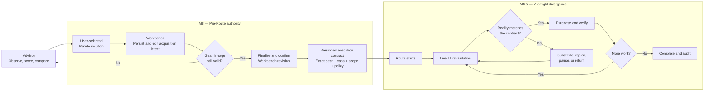

### The ownership seam

> **M8 produces a finalized, versioned, inspectable execution contract. M8.5 defines what Route may do when live reality diverges from that contract after execution begins.**

| Concern | M8: before Route starts | M8.5: after Route starts |
|---|---|---|
| Gear choice | Preserve the user-selected Advisor solution | Never change it silently |
| Workbench | Persist and directly edit acquisition intent | Treat finalized revision as immutable |
| Price authority | Define line and total caps | Consume remaining authority after purchases |
| Recovery policy | Record which recovery mode was confirmed | Apply that mode to live changes |
| Market evidence | Preserve discovery lineage and preflight readiness | Revalidate visible rows immediately before spending |
| Listing changes | May preview likely drift before finalization | Classify and handle actual changed/missing rows |
| Route shape | Record world restrictions and route preferences | Reorder remaining visits if authorized |
| Partial purchases | Not yet applicable | Treat purchases and spent gil as sunk state |
| Lineage edits | Decide whether Workbench still represents the selected solution | Procurement substitutions preserve gear lineage; gear changes return to Advisor |
| Restart/resume | Persist contract and confirmation state | Decide whether and how an interrupted route resumes |

---

# 2. Fixed invariants

These are existing roadmap constraints, not options in this review.

| Invariant | Why it exists | Consequence |
|---|---|---|
| Decision-critical live state comes from automated UI | Aggregator data and game structs cannot prove the visible row or purchase outcome | Every purchase requires UI-observed identity and result |
| Game structs do not authorize baselines, listings, purchases, or results | Struct state can be stale, incomplete, or semantically ambiguous | Structs may not bypass a failed UI observation |
| NQ and HQ are different offer identities | Quality can change stats, thresholds, utility, and value | Squire never stages `Either` |
| Advisor nomination is not purchase authority | The user may select a different Pareto solution | The selected solution—not the nomination—enters Workbench |
| Workbench is the sole editable local composition | Duplicate editors drift and confuse ownership | No separate Squire request form or staging pane |
| Route executes finalized work | Draft edits cannot silently alter active authority | Route consumes a particular finalized revision |
| A different item, quality, or required quantity may change utility | Procurement recovery must not become hidden gear advice | Such changes return to Advisor unless Fran explicitly approves broader autonomy |
| Non-gil procurement is unsupported | The system does not acquire currency-gated equipment | Only owned, gil-vendor, and market-board sources belong in supported solutions |

---

# 3. Compact glossary

| Term | Meaning |
|---|---|
| **Advisor** | Read-only Squire surface that observes, scores, compares, nominates, or abstains |
| **Selected solution** | Pareto-frontier solution explicitly selected by the user |
| **Advisor nomination** | Squire’s advisory choice; retained for comparison but not execution authority |
| **Pareto frontier** | Solutions not strictly dominated across cost, utility, burden, and evidence |
| **Workbench** | Sole editable local Market Acquisition composition |
| **Workbench revision** | Versioned snapshot of Workbench intent after an edit |
| **Finalized revision** | Revision explicitly confirmed for Route |
| **Execution contract** | Immutable, versioned authority handed from M8 to Route |
| **Gear lineage** | Proof that Workbench still represents the selected Advisor loadout |
| **Historical provenance** | Record of where lines originally came from, even after current validity is lost |
| **Exact-quality identity** | Stable item + NQ/HQ + source identity |
| **Market lot** | Required quantity assigned to one observed market row |
| **Evidence generation** | Complete market-discovery publication with source, region, scope, and revision |
| **Line cap** | Maximum authorized price or gil for one acquisition line |
| **Plan cap** | Maximum authorized total for the governed execution contract |
| **Approval envelope** | Line caps, plan cap, world scope, recovery mode, and other confirmed limits |
| **Live revalidation** | Immediate visible-UI proof before purchase |
| **Substitution** | Use another row for the same item and exact quality |
| **Route replanning** | Recalculate remaining rows and world order without changing gear |
| **Sunk state** | Purchases and gil already spent; recovery cannot pretend they did not happen |
| **Return to Advisor** | Stop Route because satisfying the goal requires a new gear decision |
| **Lease** | Time or state rule that expires confirmation |
| **Recovery mode** | Contract field declaring how much mid-flight autonomy Route may exercise |

---

# 4. Milestone outputs and gates

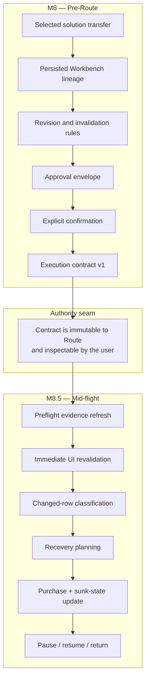

## M8 exit gate

M8 is complete only when:

- A selected solution can enter the existing Workbench with exact NQ/HQ identity.
- The full selected loadout and the market subset retain inspectable lineage.
- Workbench edits deterministically preserve or invalidate gear lineage.
- A particular Workbench revision can be finalized.
- The user can see and confirm the complete approval envelope.
- Route receives a versioned immutable contract, not a mutable draft.
- The contract grants no authority beyond what the UI showed at confirmation.
- Legacy ambiguous-quality staging remains blocked.

## M8.5 exit gate

M8.5 is complete only when:

- Route revalidates each purchase through visible game UI.
- Changed and missing rows are classified from complete, matching-scope evidence.
- Recovery cannot change item or NQ/HQ identity silently.
- Partial listings and partial purchases are handled correctly.
- Remaining caps are recomputed after every purchase.
- Cross-world replanning obeys the finalized contract.
- Pause, return-to-Advisor, restart, and resume semantics are explicit.
- Every actual purchase and recovery decision is auditable.

---

# 5. Current implemented primitives and milestone placement

The primitives below exist on the isolated M8 branch, but none are connected to Workbench or Route.

| Primitive | What it proves | Milestone | Why |
|---|---|---|---|
| `OutfitterWorkbenchTransfer` | Preserves selected solution, full loadout, exact market rows, utility context, and evidence lineage | **M8** | It defines what can enter Workbench |
| `OutfitterWorkbenchTransferBuilder` | Rejects solutions outside the frontier, mismatched evidence, unavailable quantities, and no-market handoffs | **M8** | It protects the pre-Route handoff |
| Transfer schema version | Makes the non-persisted handoff inspectable and versionable | **M8** | It should become part of the finalized contract |
| `OutfitterWorkbenchTransferReviewer` | Compares accepted lots against complete same-scope refreshed evidence | **M8.5** | It reasons about changed reality |
| `OutfitterWorkbenchLotChange` | Classifies missing rows, price/quantity changes, quality changes, world changes, and revisions | **M8.5** | Those facts matter after or immediately before execution |
| `OutfitterWorkbenchReplacementRows` | Enumerates same-item, exact-quality alternative rows and cost deltas | **M8.5** | It is recovery input, not pre-Route authority |

### Deliberate crossing fields

Some data is created in M8 but consumed in M8.5:

| Field | M8 responsibility | M8.5 responsibility |
|---|---|---|
| Exact item and quality | Persist immutable identity | Enforce it during recovery |
| Required quantity | Confirm intended quantity | Track remaining quantity |
| Line and plan caps | Define absolute authority | Subtract spending and test recovery |
| Allowed worlds | Confirm scope | Restrict replanning |
| Recovery mode | Record the user’s selected policy | Implement its precise semantics |
| Confirmation time | Record when authority was granted | Apply any lease or stale-intent rule |
| Evidence lineage | Explain planning basis | Compare against refreshed/live evidence |
| Workbench revision | Bind confirmation | Reject execution from a different revision |

---

# 6. End-to-end timeline

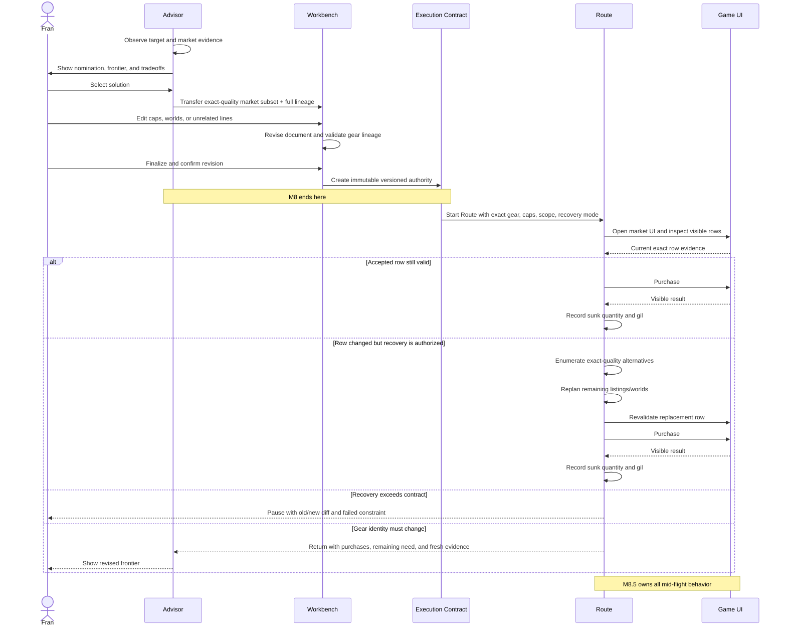

---

# 7. M8 decisions: pre-Route authority

## M8-A. What exactly is persisted?

### Controlled invariant

The finalized contract must prove what the user selected and confirmed. It cannot reconstruct authority later from current defaults.

### Failure modes

- Persisting only item lines and losing the selected solution.
- Persisting relative tolerances and recomputing larger caps after refresh.
- Keeping per-line “From Squire” labels while losing proof that the complete loadout remains intact.
- Allowing Route to consume the latest mutable Workbench rather than the confirmed revision.
- Mixing unrelated manual lines into Squire cost authority without clearly defining scope.

### Contract composition options

| Option | Persisted model | User-visible behavior | Consequences | Safety / annoyance / reversibility |
|---|---|---|---|---|
| **A1. Lines only** | Item, quality, quantity, caps | Simple ordinary Workbench | Cannot prove complete selected solution or utility context | Low safety; low UI burden; costly migration later |
| **A2. Per-line provenance** | Each line stores Squire origin and selected solution ID | Rows remain individually traceable | Deleted lines can leave an incomplete “Squire” set that looks valid | Medium safety; flexible mixed work; needs later solution integrity |
| **A3. Solution-level contract** | Selected solution, full slot lineage, market subset, caps, scope, revision | Workbench can say whether selected solution remains intact | Strong integrity; requires versioned metadata | High safety; moderate complexity; best long-term seam |
| **A4. Entire Advisor snapshot** | Full frontier and evidence serialized into Workbench | Maximum audit detail | Large, patch-sensitive state; duplicates Advisor | High storage/complexity; expensive migration |
| **A5. No persistence; regenerate at Route start** | Route asks Advisor again | Little stored state | Results may change between confirmation and execution; confirmation loses meaning | Unsafe authority reconstruction |

### Recommendation

Use **A3: a versioned solution-level execution contract**, retaining enough structural diff information for audit but not copying the entire frontier.

Minimum persisted fields:

```text
contract schema/version
contract ID
origin = SquireOutfitter
selected solution ID
Advisor nomination ID (comparison only)
utility profile ID/version
utility context ID
full selected loadout lineage
Squire-owned market lines
exact NQ/HQ identity
required quantities
observed evidence generation/revision/scope
expected market cost
absolute line caps
absolute plan cap
cap scope
allowed worlds / travel scope
recovery mode
Workbench document ID/revision
confirmation timestamp
confirmation identity/state
historical provenance + current lineage validity
```

---

## M8-B. Approval-envelope model

### Purpose

The envelope bounds procurement drift after the user chooses gear. It must not limit which solutions the Advisor displays.

### Scenarios

| Scenario | Observed plan | Change before Route | Decision pressure |
|---|---:|---:|---|
| Small ordinary drift | 420,000 gil | One line +3,000; another −5,000; total 418,000 | Should harmless aggregate improvement proceed? |
| Aggregate adverse drift | 1,200,000 gil | Four lines rise; revised total 1,400,000 | Individually tolerable changes create material total exposure |
| Concentrated outlier | 600,000 gil | One 20,000-gil accessory becomes 150,000 | Total-only cap might authorize an absurd line |
| Broad cheapening | 900,000 gil | New rows reduce total to 760,000 | No reason to interrupt if identity and scope remain unchanged |

### Enforcement choices

| Option | Rule | User-visible behavior | Safety | Annoyance | Automation | Implementation / migration |
|---|---|---|---:|---:|---:|---|
| **B1. Exact observed-price lock** | No line may rise | Any increase needs review | Very high | High | Low | Easy initial model; easy to loosen |
| **B2. Per-line caps only** | Every line stays below its cap | Inline guardrails | High against outliers | Medium | Good | Existing fields align; aggregate exposure remains weak |
| **B3. Plan cap only** | Complete total stays below one maximum | One prominent number | High against total overrun | Low | High | Weak against one terrible purchase |
| **B4. Layered line + plan caps** | Every line and total must remain valid | Expected/maximum total plus inline limits | Highest practical balance | Medium | High | More state, but clearest authority |
| **B5. Confirm every changed plan** | Any upward or structural change pauses | Explicit old/new diff | Very high | Very high | Low | Strong rollout fallback |
| **B6. No price envelope** | Buy exact gear at current price | Almost no interruption | Poor | Lowest | Maximum | Unacceptable financial exposure |

### Cap-entry choices

These are presentation choices; authoritative persistence should remain absolute.

| Entry method | Strength | Weakness | Recommended persistence |
|---|---|---|---|
| Absolute maximum | Unambiguous final authority | User must calculate headroom mentally | Persist directly |
| Extra gil | Easy to reason about | Depends on visible baseline | Derive and persist absolute maximum |
| Percentage | Scales with plan | Behaves oddly across cheap/expensive lines | Derive and persist absolute maximum |
| Synchronized absolute + delta + percent | Most informative | More UI density | Persist absolute maximum; other values are projections |
| Plugin-selected hidden tolerance | Fast common path | Authority becomes invisible | Do not use |

### Cap-scope choices

| Scope | Meaning | Consequence |
|---|---|---|
| **Squire subset only** | Plan cap governs the exact gear lines transferred by Advisor | Clean relationship to selected solution’s expected cost |
| **Entire Workbench** | Cap includes unrelated manually added lines | One total, but Advisor never evaluated those lines |
| **Separate envelopes** | Squire subset and manual work each have independent totals | Most honest mixed-composition model; more UI/state |
| **No mixed finalized plan** | Squire work must be finalized separately | Simplifies authority but fragments Workbench workflow |

### Recommendation

- Use **B4: layered absolute line and plan caps**.
- Let the user edit synchronized absolute, extra-gil, and percentage views.
- Persist only fixed absolute authority.
- Default the plan cap to the **Squire subset**.
- Keep unrelated manual lines visible but independently governed.
- Allow zero upward drift.
- Show defaults before confirmation; never hide them.

---

## M8-C. Workbench revisions and confirmation

### State model

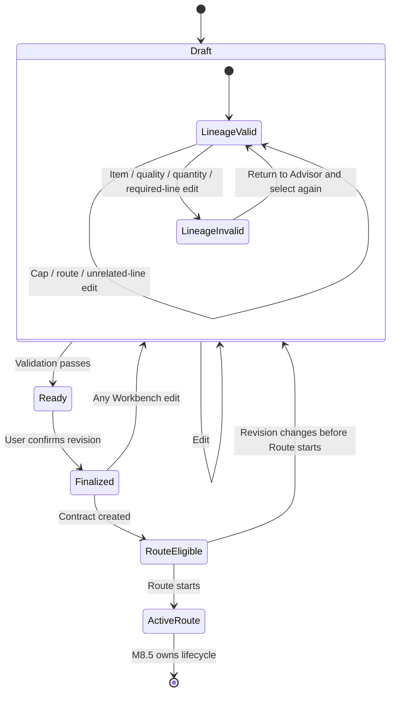

### Revision choices

| Option | Confirmation binds | Consequence |
|---|---|---|
| **C1. Latest Workbench implicitly** | Whatever exists when Route starts | Mutable authority; unsafe |
| **C2. Document ID only** | Composition identity, not exact revision | Later edits can leak into Route |
| **C3. Document ID + revision** | Exact finalized state | Strong, inspectable authority |
| **C4. Content hash only** | Exact content bytes | Correct but opaque to users and diagnostics |
| **C5. Revision + canonical intent hash** | Human revision plus tamper/drift proof | Strongest practical model |

### Confirmation choices

| Option | User action | Behavior |
|---|---|---|
| Explicit final confirmation | User confirms exact revision and envelope | Clear authority boundary |
| Implicit when opening Route | Navigation grants authority | Too easy to spend accidentally |
| Per-line confirmation | User confirms each row | Excessive friction and fragmented plan authority |
| External/global “auto-buy” setting | Persistent setting grants authority | Too broad; cannot explain current plan |
| Signed reusable policy | User pre-approves a class of plans | Potential future expert feature; too broad for first M8 |

### Recommendation

Use **C5**:

- Every edit increments the Workbench revision.
- Finalization binds document ID, revision, and canonical intent hash.
- Confirmation explicitly shows exact quality, quantities, expected cost, maximum cost, and recovery mode.
- Route rejects any different revision.
- Opening Route does not itself grant authority.

---

## M8-D. Lineage preservation and invalidation

### Two-dimensional state

Gear lineage and procurement authority should not be one boolean.

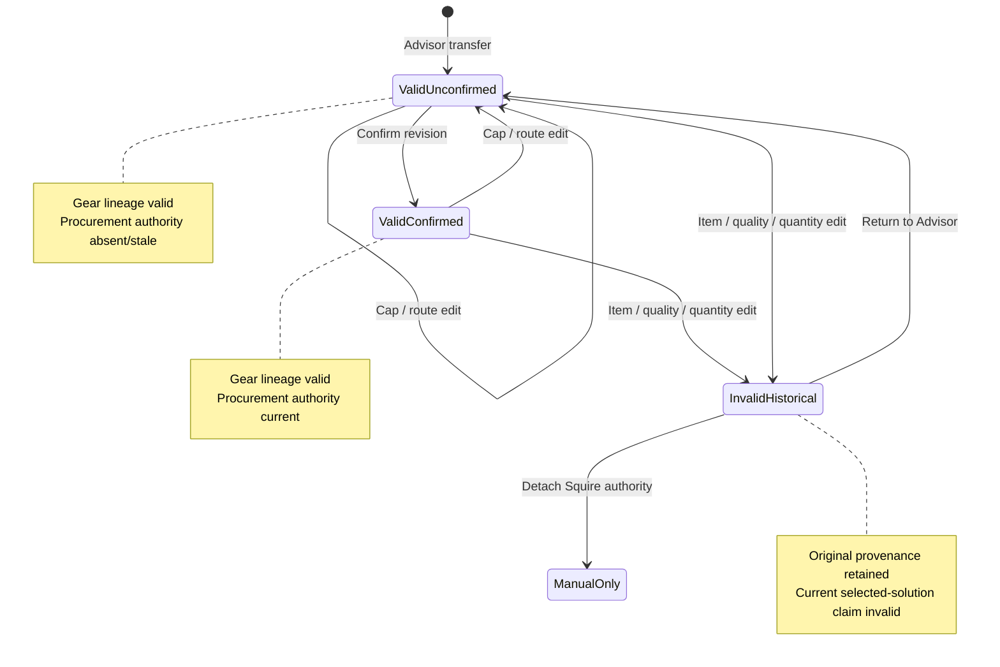

### Edit classification

| Edit | Gear lineage | Confirmation | Why |
|---|---|---|---|
| Change item | Invalidate | Invalidate | Different gear |
| Change NQ ↔ HQ | Invalidate | Invalidate | Different stats/value/offer identity |
| Change required quantity | Invalidate | Invalidate | Selected loadout completeness changes |
| Delete required Squire line | Invalidate | Invalidate | Solution is incomplete |
| Replace one exact listing with another | Preserve | Depends on phase; M8.5 recovery policy | Procurement changes, gear does not |
| Change line cap | Preserve | Invalidate | Gear same, spending authority changed |
| Change plan cap | Preserve | Invalidate | Gear same, total authority changed |
| Change allowed worlds | Preserve | Invalidate | Gear same, route authority changed |
| Add unrelated manual line | Preserve Squire subset | Invalidate mixed Workbench finalization | New work was not in confirmed revision |
| Delete unrelated manual line | Preserve Squire subset | Invalidate revision | Composition changed, gear did not |
| Change target character | Invalidate | Invalidate | Selected solution belongs to another target |
| Change utility context/profile | Invalidate | Invalidate | Meaning of selected solution changes |

### Credible lineage models

| Option | Model | Safety | Friction | Long-term cost |
|---|---|---:|---:|---|
| **D1. Any edit invalidates everything** | Simple all-or-nothing | High | High | Easy to refine |
| **D2. Semantic invalidation** | Gear edits invalidate; procurement edits preserve lineage but require confirmation | High | Low–medium | Requires explicit metadata |
| **D3. Per-line provenance only** | Rows know origin; complete solution has no integrity state | Medium | Low | Costly to add solution integrity later |
| **D4. Historical provenance + current validity** | Preserve origin and diff while current authority is explicit | High | Low | More state, best audit |
| **D5. Automatic Advisor rerun on gear edit** | Workbench acts as constrained gear editor | Context-dependent | Low when successful | Creates duplicate recommendation surface |
| **D6. Never invalidate** | Squire label survives every edit | Poor | Lowest | Ambiguous persisted state |

### Recommendation

Combine **D2 + D4**:

- Use semantic invalidation for current validity.
- Preserve historical provenance and structural diff.
- Never let historical origin masquerade as current authority.
- Offer “Return to Advisor with these constraints.”
- Do not automatically turn Workbench into another loadout editor.

---

## M8-E. What recovery authority is declared before Route?

M8 should not implement recovery, but the finalized contract must say which M8.5 behavior the user approved.

### Declaration options

| Recovery mode stored in contract | Meaning at the seam |
|---|---|
| `ExactRowOnly` | Route may purchase only a still-valid accepted row |
| `ReviewEveryChange` | Route may calculate alternatives but must pause before using them |
| `SameWorldExactQuality` | Route may substitute same-item, exact-quality rows on the current world |
| `CrossWorldExactQuality` | Route may replan remaining exact-quality procurement across allowed worlds |
| `AdvisorReselectionAllowed` | Route may trigger or perform a new gear decision—high-risk future mode |
| `NoRecovery` | Any divergence stops execution |

M8 must persist the selected mode exactly. M8.5 defines its operational semantics, especially partial rows, sunk state, and resume behavior.

### Recommendation

For the balanced bundle, M8 should expose and persist `CrossWorldExactQuality`, but Route authority must remain disabled until M8.5 fully implements and tests it.

A conservative initial release could expose `ReviewEveryChange` while preserving the same contract schema.

---

# 8. M8.5 decisions: mid-flight divergence

## M8.5-A. Live UI revalidation

### Non-negotiable spending boundary

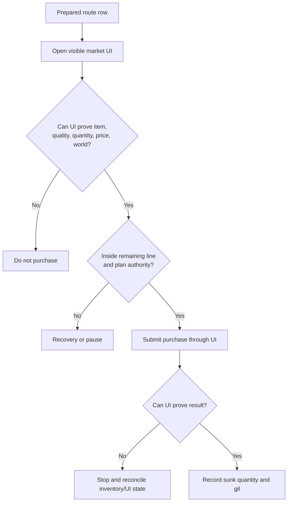

### Revalidation timing options

| Option | Timing | Safety | Cost / annoyance |
|---|---|---:|---|
| Route-start only | Validate once before travel | Poor | Fast but stale during long routes |
| Once per world | Validate all rows on arrival | Medium | Rows can still change before later purchases |
| Before each line | Validate when line becomes active | High | Appropriate minimum |
| Before each purchase/row | Validate exact visible row immediately before spending | Highest | More UI reads; required for partial combinations |
| Aggregator-only refresh | No visible UI proof | Invalid | Violates roadmap |

### Recommendation

Revalidate the exact visible row **immediately before every purchase**, then prove the result through UI. There is no trustworthy shortcut.

---

## M8.5-B. Changed-market decision path

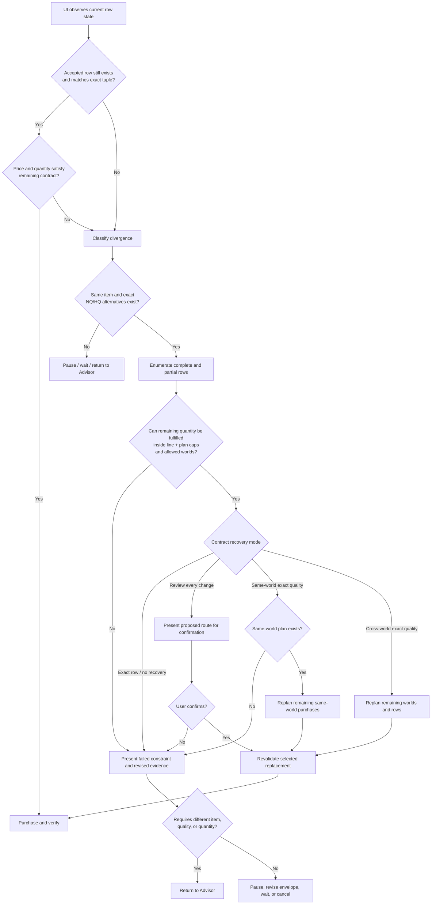

---

## M8.5-C. Recovery authority options

### Scenarios

| Scenario | Live change | Procurement consequence |
|---|---|---|
| Safe local substitution | Accepted HQ row disappears; cheaper HQ row exists on same world | Gear unchanged; trivial procurement repair |
| Cross-world improvement | Accepted row disappears; another allowed world already lies on route | Replanning may reduce burden |
| Partial ring recovery | Quantity-two HQ row disappears; two quantity-one HQ rows remain | Correct plan combines rows; NQ quantity-two row is forbidden |
| Identity failure | Selected HQ tool unavailable; another tool appears similar | Must return to Advisor under recommended boundary |
| Cap failure | Exact HQ replacement exists but exceeds line cap | Pause or revise authority |
| Aggregate failure | Each replacement fits line cap, but combined route exceeds plan cap | Pause despite locally legal rows |

### Recovery options

| Option | Automatic authority | User-visible behavior | Safety | Annoyance | Complexity / migration |
|---|---|---|---:|---:|---|
| **R1. No autonomous recovery** | None | Pause on every change | Highest | High | Simplest; easy to broaden |
| **R2. Exact accepted row only** | Same row if still valid | Missing row always pauses | Very high | High | Depends on row-ID stability |
| **R3. Same-world exact-quality** | Substitute/combine rows on current world | Local repair stays quiet | High | Medium | Cannot exploit sensible existing route worlds |
| **R4. Cross-world exact-quality** | Replan rows and remaining visits across allowed worlds | Healthy recovery is quiet | High with strict caps | Low | Genuine route planner required |
| **R5. Propose full recovery, require confirmation** | Planning autonomous; execution manual | One old/new diff | Very high | Medium | Strong staged rollout |
| **R6. Different gear within utility floor** | Item/quality may change | Purchased result may differ from selection | Medium | Low until surprising | Profile-version authority and re-solving required |
| **R7. Fully autonomous Advisor reselection** | Any supported Pareto solution | Route may change entire gear plan | Poor for M8.5 | Lowest | Pulls M10 sunk-cost/portfolio policy forward |

### Recommendation

Use **R4: cross-world exact-quality recovery**, bounded by:

- Same item.
- Same NQ/HQ quality.
- Same required total quantity.
- Allowed worlds.
- Remaining line cap.
- Remaining plan cap.
- No unsupported acquisition source.
- Immediate revalidation of every chosen replacement.

Any item, quality, or required-quantity change returns to Advisor.

For staged rollout, implement **R5** first while preserving the R4-capable contract.

---

## M8.5-D. Partial-row combination

A listing row is not necessarily an entire line. Route may need several rows to fulfill one required quantity.

### Allocation example

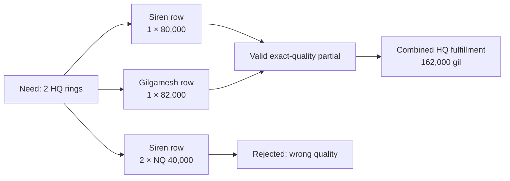

### Combination choices

| Option | Rule | Consequence |
|---|---|---|
| One row must fulfill line | No combinations | Simple but rejects ordinary ring/stack cases |
| Combine rows on one world | Sum exact-quality rows locally | Good moderate scope |
| Combine rows across worlds | Global remaining allocation | Best recovery; more route complexity |
| Partial purchase only after confirmation | Show multi-row plan first | Conservative rollout |
| Greedy cheapest-row selection | Choose cheapest visible rows first | Can create worse world route or strand quantity |
| Exact remaining-route optimization | Evaluate cost, worlds, transactions, and caps together | Correct but more computational work |

### Recommendation

Permit combinations across allowed worlds and optimize the **complete remaining route**, not each row greedily. The solver must include already purchased quantities and cannot exceed the remaining line or plan authority.

---

## M8.5-E. Partial purchases and sunk state

Once gil is spent, the original plan is no longer the correct optimization baseline.

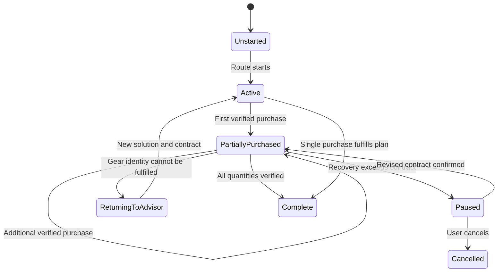

### Remaining-authority calculation

For each line:

```text
remaining quantity
= confirmed required quantity
- verified purchased quantity
```

For the plan:

```text
remaining plan authority
= confirmed maximum total
- verified gil already spent
```

A recovery plan must satisfy:

```text
projected cost of all remaining purchases
<= remaining plan authority
```

It must also satisfy each remaining line cap according to the chosen line-cap semantics.

### Sunk-state choices

| Option | Recovery treatment | Risk |
|---|---|---|
| Ignore prior purchases and replan from scratch | May duplicate purchases or exceed cap | Invalid |
| Treat purchased items as owned | Advisor/recovery plans around verified acquisitions | Recommended |
| Offer to resell unwanted purchases | Adds market-sale automation and loss policy | Out of scope |
| Cancel and abandon purchased items | Safe operationally, but may leave incomplete set | Must be clearly reported |
| Permit cap overrun because prior purchases are sunk | Converts failure into unapproved spending | Invalid |

### Recommendation

Every verified purchase becomes an owned input for any return to Advisor. Spent gil remains charged against the confirmed plan cap. No recovery rule may erase sunk state.

---

## M8.5-F. Pause versus return to Advisor

| Condition | Pause inside Route | Return to Advisor |
|---|---:|---:|
| Exact row changed but legal alternative exists | No, if recovery mode permits | No |
| Alternative exceeds a cap | Yes | Optional only if user wants another gear solution |
| Allowed-world restriction blocks alternatives | Yes | Optional |
| Market evidence incomplete or UI observation fails | Yes | No automatic gear change |
| Exact item unavailable everywhere | Yes initially | Yes when user chooses re-evaluation |
| Only different quality is available | No substitution | Yes |
| Only different item is available | No substitution | Yes |
| Required quantity changed by Workbench edit | Active contract invalid | Yes through M8 re-finalization |
| Utility profile/context changed | Route cannot reinterpret | Yes |
| User cancels | Stop | No automatic return |
| Partial purchases exist and exact completion fails | Pause with sunk-state summary | Recommended return path |

### User-visible pause payload

A useful pause should show:

- What changed.
- Accepted versus current row.
- Exact item and quality.
- Remaining quantity.
- Gil already spent.
- Remaining line and plan authority.
- Cheapest authorized recovery, if any.
- Cheapest exact-quality recovery outside authority.
- Added or removed worlds.
- Failed constraint.
- Available actions: revise envelope, wait/refresh, cancel, or return to Advisor.

---

## M8.5-G. Freshness, leases, and confirmation during execution

### Freshness timeline

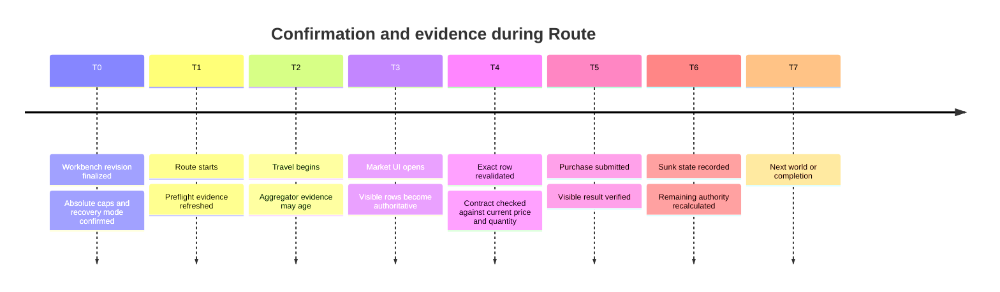

### Scenarios

| Scenario | Timer result | UI-revalidation result | What actually protects the user |
|---|---|---|---|
| Row unchanged after 12 minutes | Five-minute lease says stale | UI proves exact row valid | UI proof |
| Row disappears after 30 seconds | Five-minute lease says fresh | UI rejects row | UI proof |
| Route resumes next day | No short lease may still be “valid” under state-only model | Intent may be stale even if rows exist | Explicit stale-intent/resume policy |
| New evidence revision, same legal rows | Generation-tied confirmation expires | UI and envelope remain valid | Structural/current-state comparison |

### Lease options

| Option | Rule | Safety | Annoyance | Automation | Consequence |
|---|---|---:|---:|---:|---|
| **F1. Fixed short lease** | Confirmation expires after e.g. five minutes | Superficial | High | Low | Time is a poor proxy for live truth |
| **F2. Refresh-renewed lease** | Complete provider refresh extends approval | Medium | Medium | Good when provider healthy | Couples authority to aggregator availability |
| **F3. Revision-bound, no active-route clock** | Confirmation remains while revision/contract is unchanged | High with UI checks | Low | High | Needs explicit restart policy |
| **F4. Long stale-intent maximum + UI checks** | Active route uses UI checks; old inactive plan eventually expires | Very high | Low–medium | High | Good if plans can sit queued |
| **F5. Evidence-generation-bound** | Any new generation invalidates confirmation | High | High | Low | Exposes evidence mechanics as user labor |
| **F6. Route-start check only** | No per-purchase revalidation | Poor | Low | High | Invalid under roadmap |
| **F7. Aggregator authority** | Provider data authorizes purchase | Invalid | Low | High | Violates UI-only authority |

### Recommendation

- Use **F3 during an actively progressing route**.
- Consider **F4 for abandoned, restarted, or long-idle routes**.
- Never use a five-minute lease as proof that a row is safe.
- Workbench revision changes always invalidate confirmation.
- Immediate UI revalidation remains mandatory regardless of time.

Fran must still choose whether inactive finalized contracts receive a maximum age.

---

## M8.5-H. Restart and resume

### Resume state machine

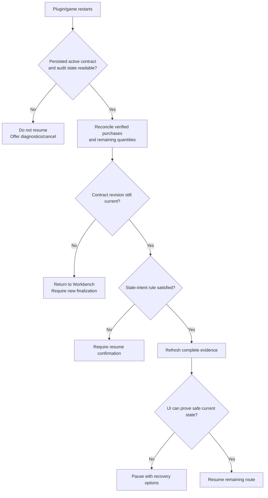

### Resume options

| Option | Behavior | Safety | Friction | Migration / expectation |
|---|---|---:|---:|---|
| Never resume | Restart cancels Route | High | High | Simple but wastes progress |
| Always resume automatically | Continue after UI reconciliation | Medium–high | Low | Users may not expect spending after restart |
| Require explicit resume confirmation | Show remaining authority and purchases | Very high | Moderate | Clear first-release behavior |
| Auto-resume within age; confirm after age | Balanced | High | Low–moderate | Requires persisted timestamp semantics |
| Resume only if no purchases occurred | Conservative split | High | Moderate | Partial routes always need review |

### Recommendation

For the first M8.5 release:

- Persist complete sunk state and contract identity.
- Never resume spending invisibly after restart.
- Present a concise remaining-plan review.
- Require explicit resume confirmation.
- Revalidate evidence and UI before continuing.

Auto-resume within a bounded active session can be considered later.

---

# 9. Coherent policy bundles

## Comparison matrix

| Axis | Conservative / manual | Balanced / recommended | Permissive / autonomous |
|---|---|---|---|
| M8 contract | Exact solution + strict caps | Exact solution + layered caps | Outcome-oriented contract |
| Line authority | Observed price or explicit strict cap | Adjustable absolute cap | Broad or absent line caps |
| Plan authority | Exact/strict total | Absolute total cap | Broad total or utility/cost target |
| Cap entry | Absolute only | Absolute + delta + percent views | Relative policy/default |
| Mixed Workbench | Prefer separate finalization | Squire subset has independent envelope | Whole composition optimized together |
| Lineage | Any meaningful edit invalidates | Semantic invalidation + history | Automatic constrained re-solving |
| Recovery declaration | Review every change | Cross-world exact-quality | Advisor reselection permitted |
| UI revalidation | Every purchase | Every purchase | Every purchase remains mandatory |
| Listing substitution | Proposed manually | Automatic inside contract | Automatic |
| Partial-row combination | Proposed manually | Automatic exact-quality allocation | Automatic |
| Cross-world replanning | User confirms | Automatic inside allowed scope | Automatic with broad scope |
| Different item/quality | Return to Advisor | Return to Advisor | May change within utility floor |
| Partial purchases | Pause/review | Replan remaining state | Reoptimize outcome |
| Active-route lease | Short/moderate lease + UI | Revision-bound + UI | Revision-bound + UI |
| Restart | Explicit resume | Explicit resume initially | Automatic after reconciliation |
| Safety | Highest | High | Context-dependent |
| Annoyance | High | Low–moderate | Lowest |
| Automation | Low–moderate | High | Maximum |
| Implementation cost | Lowest | Substantial | Very high |
| Persisted-state risk | Low | Moderate | High |
| User-expectation risk | Low | Moderate | High |

---

## Bundle A — Conservative / manual

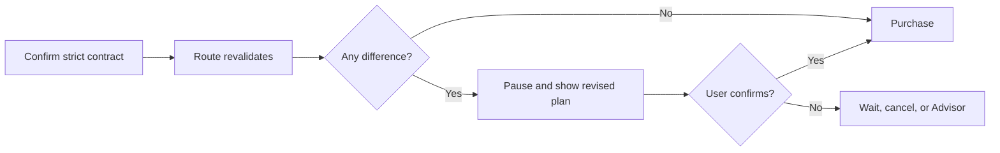

**Rules**

- Exact observed-price lock or strict explicit caps.
- Every changed row produces a review.
- No silent cross-world replan.
- Gear edits invalidate lineage.
- Short or moderate confirmation lease may apply.
- Restart always requires confirmation.

**Strengths**

- Best early debugging and audit posture.
- Easy to understand.
- Least chance of surprising spend or travel.
- Safe fallback even after balanced mode ships.

**Weaknesses**

- Ordinary volatility creates repeated interruptions.
- Strong recovery evidence exists but cannot act.
- Long routes can feel brittle.
- Timer expiry may create user work without changing safety.

---

## Bundle B — Balanced / recommended

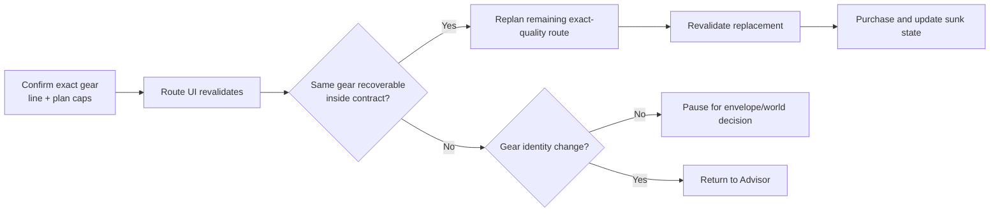

**Rules**

- Versioned solution-level execution contract.
- Absolute per-line and plan-wide caps.
- Exact item, quality, and quantity immutable.
- Semantic lineage invalidation.
- Automatic exact-quality partial-row and cross-world recovery.
- Immediate UI revalidation before every purchase.
- No short lease during an active route.
- Explicit resume after restart.

**Strengths**

- Clear Advisor/Route boundary.
- Strong financial protection.
- Quiet healthy automation.
- Market changes are repaired without claiming different gear is equivalent.
- Recoveries remain inspectable and auditable.

**Weaknesses**

- Requires real remaining-route optimization.
- Requires robust sunk-state persistence.
- More schema and state-machine work.
- Needs careful UI for cap scope and pause reasons.

---

## Bundle C — Permissive / autonomous

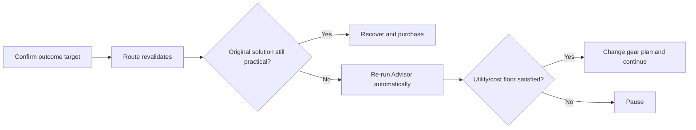

**Rules**

- Broad total cap or utility/cost outcome.
- Route may select a different supported solution.
- Workbench gear edits trigger automatic re-solving.
- Minimal confirmation interruptions.
- Restart may auto-resume.

**Strengths**

- Maximum resilience.
- Minimum user intervention.
- Can exploit newly available alternatives.

**Weaknesses**

- Confirmation must encode utility floors and threshold protection.
- Utility-profile changes become authority migrations.
- Purchases may differ from the selected gear.
- Sunk purchases create portfolio and hand-me-down questions.
- Workbench risks becoming a duplicate Advisor.
- Pulls M10 policy into M8.5.

**Recommendation:** Do not use as the first execution-authority release.

---

# 10. Decision dependencies and blockers

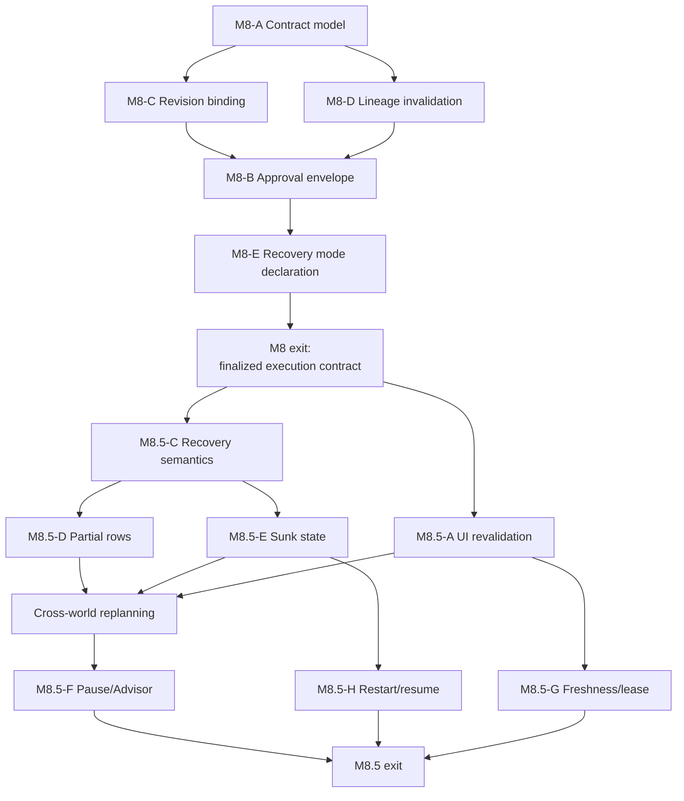

## What blocks M8

| Decision | Must be settled before M8 implementation? | Why |
|---|---:|---|
| Solution-level versus line-only persistence | Yes | Determines schema and integrity model |
| Workbench revision binding | Yes | Defines what Route may consume |
| Line and plan cap structure | Yes | Core execution-contract fields |
| Cap scope for mixed Workbench | Yes | Changes authoritative total |
| Lineage invalidation categories | Yes | Determines edit behavior and readiness |
| Explicit confirmation surface | Yes | Defines authority grant |
| Recovery mode field | Yes | Contract must declare intended M8.5 behavior |
| Exact M8.5 route algorithm | No | M8 can persist an inactive mode |
| Partial purchase behavior | No | No purchases occur in M8 |
| Restart/resume execution | No | M8 persists contract identity only |

## What blocks M8.5

| Decision | Must be settled before M8.5 implementation? | Why |
|---|---:|---|
| UI revalidation timing | Yes | Spending boundary |
| Automatic recovery scope | Yes | Core Route authority |
| Partial-row combinations | Yes | Quantity correctness |
| Cross-world replanning | Yes if authorized mode exists | Route engine architecture |
| Sunk-state accounting | Yes | Prevent duplicate/over-cap purchases |
| Pause versus Advisor boundary | Yes | Prevent silent gear changes |
| Active-route lease | Yes | Determines mid-flight validity |
| Restart/resume | Yes for persisted routes | Prevent invisible post-restart spending |
| Different-gear autonomy | No if explicitly excluded | Can remain future work |
| Auto-resume | No | Explicit confirmation is safe default |

---

# 11. Reversibility and migration cost

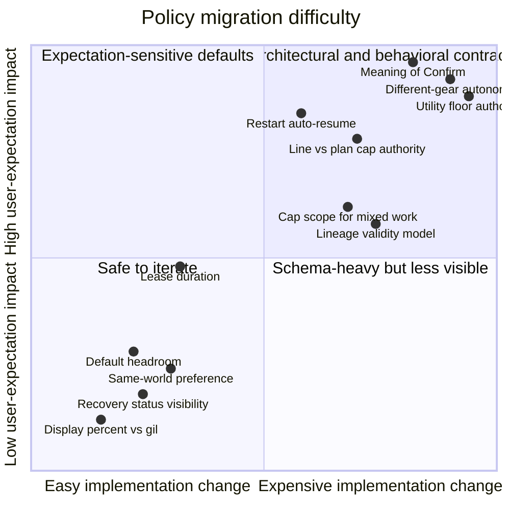

## Easy to change later

- Displaying headroom as absolute gil, delta, percentage, or synchronized views.
- Suggested default headroom.
- Whether cap details start expanded.
- Same-world preference among equally authorized routes.
- Whether healthy substitutions produce transient status.
- Conservative versus balanced recovery mode, if the contract records it explicitly.
- A long stale-intent duration.
- Route sorting among equivalent legal alternatives.

## Moderate migration cost

- Adding a plan cap to line-cap-only contracts.
- Adding line caps to total-only contracts.
- Changing whether the cap covers Squire lines or the whole Workbench.
- Adding recovery-policy fields to existing finalized documents.
- Splitting historical provenance from current validity.
- Introducing solution-level integrity after per-line provenance.
- Persisting restart/resume state.

Safe migration must never infer broader authority. Old contracts should require reconfirmation.

## High migration and expectation cost

- Changing what “Confirm” authorizes.
- Moving from exact gear to autonomous different-gear selection.
- Persisting relative tolerances without fixed absolute maxima.
- Making Workbench a second Advisor.
- Binding execution authority to mutable utility scores.
- Automatically resuming spending after restart.
- Removing per-purchase UI revalidation.
- Treating historical provenance as current authority.
- Allowing plan-wide savings to justify arbitrarily overpriced individual lines after users learned otherwise.

---

# 12. Recommendations, separated from facts

## Recommended M8

1. Persist a versioned solution-level execution contract.
2. Bind it to Workbench document ID, revision, and canonical intent hash.
3. Use layered absolute line and plan caps.
4. Allow synchronized absolute, extra-gil, and percentage entry.
5. Scope the initial plan cap to Squire-owned lines.
6. Use semantic lineage invalidation plus historical provenance.
7. Require explicit confirmation.
8. Persist the selected recovery mode but do not activate Route until M8.5.
9. Keep legacy `Either` staging blocked.
10. Expose the complete contract for inspection and audit.

## Recommended M8.5

1. Revalidate every visible row immediately before purchase.
2. Verify every purchase result through UI.
3. Allow automatic same-item, exact-quality partial-row and cross-world recovery inside all finalized constraints.
4. Optimize the complete remaining route rather than greedily selecting rows.
5. Treat verified purchases and gil as sunk state.
6. Preserve gear lineage during procurement-only recovery.
7. Return to Advisor for any item, quality, or required-quantity change.
8. Use no short lease during an active progressing route.
9. Require explicit resume after restart for the initial release.
10. Keep a conservative “review every change” mode available.

---

# 13. Decision worksheet for Fran

No unchecked answer is inferred. Fran may approve a bundle or specify individual choices.

## M8 — Pre-Route decisions

### Contract and persistence

- [ ] Persist lines only.
- [ ] Persist per-line provenance.
- [ ] Persist a solution-level execution contract.
- [ ] Persist another model: `____________________________`

- [ ] Bind confirmation to Workbench document ID and revision.
- [ ] Also bind a canonical intent hash.
- [ ] Use another binding: `____________________________`

### Approval envelope

- [ ] Exact observed-price lock.
- [ ] Per-line caps only.
- [ ] Plan cap only.
- [ ] Layered line and plan caps.
- [ ] Confirm every changed plan.
- [ ] Another model: `____________________________`

Cap entry:

- [ ] Absolute maximum only.
- [ ] Extra gil only.
- [ ] Percentage only.
- [ ] Synchronized absolute, extra-gil, and percentage views.
- [ ] Other: `____________________________`

Cap scope:

- [ ] Squire-owned lines only.
- [ ] Complete mixed Workbench.
- [ ] Separate Squire and manual envelopes.
- [ ] Do not allow mixed finalization.
- [ ] Other: `____________________________`

### Lineage

For item, NQ/HQ, quantity, or required-line removal:

- [ ] Invalidate selected-solution integrity.
- [ ] Automatically rerun Advisor.
- [ ] Preserve lineage anyway.
- [ ] Other: `____________________________`

For cap, world, or route-preference edits:

- [ ] Preserve gear lineage but require reconfirmation.
- [ ] Invalidate all lineage.
- [ ] Preserve confirmation.
- [ ] Other: `____________________________`

Historical provenance:

- [ ] Retain original lineage and show a structural diff.
- [ ] Discard lineage on invalidation.
- [ ] Other: `____________________________`

Mixed manual lines:

- [ ] Preserve lineage for the Squire subset.
- [ ] Invalidate the entire composition.
- [ ] Disallow mixed work.
- [ ] Other: `____________________________`

### Confirmation and Route handoff

- [ ] Require explicit final confirmation.
- [ ] Opening Route implicitly confirms.
- [ ] Use another boundary: `____________________________`

Recovery mode recorded in the contract:

- [ ] No recovery.
- [ ] Exact accepted row only.
- [ ] Review every changed plan.
- [ ] Same-world exact-quality.
- [ ] Cross-world exact-quality.
- [ ] Different gear within a utility floor.
- [ ] Other: `____________________________`

### M8 approval shortcut

- [ ] Approve the recommended M8 bundle exactly as written.
- [ ] Approve with these exceptions:

```text


```

---

## M8.5 — Mid-flight decisions

### UI revalidation

- [ ] Revalidate once at Route start.
- [ ] Revalidate once per world.
- [ ] Revalidate before every line.
- [ ] Revalidate every exact row immediately before purchase.
- [ ] Other: `____________________________`

Purchase results:

- [ ] Require visible-UI result verification.
- [ ] Other: `____________________________`

### Recovery scope

- [ ] No autonomous recovery.
- [ ] Exact accepted row only.
- [ ] Same-world, same-item, exact-quality substitution.
- [ ] Cross-world, same-item, exact-quality replanning.
- [ ] Construct revised route but require confirmation.
- [ ] Different gear inside a utility floor.
- [ ] Fully autonomous Advisor reselection.
- [ ] Other: `____________________________`

Partial rows:

- [ ] One row must satisfy the complete line.
- [ ] Combine exact-quality rows on one world.
- [ ] Combine exact-quality rows across allowed worlds.
- [ ] Require confirmation before any combination.
- [ ] Other: `____________________________`

Route optimization:

- [ ] Greedy cheapest-row selection.
- [ ] Optimize complete remaining route across cost, worlds, and transactions.
- [ ] Other: `____________________________`

### Identity boundary

If recovery requires another item:

- [ ] Return to Advisor.
- [ ] Permit automatic reselection.
- [ ] Other: `____________________________`

If recovery requires NQ instead of HQ or HQ instead of NQ:

- [ ] Return to Advisor.
- [ ] Permit automatic quality substitution.
- [ ] Other: `____________________________`

If required quantity changes:

- [ ] Return through Workbench/Advisor and finalize a new contract.
- [ ] Permit Route to change it.
- [ ] Other: `____________________________`

### Partial purchases and failure

Verified purchases should:

- [ ] Become owned inputs for future Advisor/recovery work.
- [ ] Remain charged against the contract cap.
- [ ] Follow another rule: `____________________________`

When exact gear remains available but exceeds authority:

- [ ] Pause for envelope revision.
- [ ] Wait and refresh.
- [ ] Offer both.
- [ ] Cancel automatically.
- [ ] Other: `____________________________`

When exact gear cannot be fulfilled:

- [ ] Pause and offer return to Advisor.
- [ ] Keep waiting indefinitely.
- [ ] Automatically reselect gear.
- [ ] Other: `____________________________`

### Freshness and leases

During an active route:

- [ ] Fixed short lease.
- [ ] Refresh-renewed lease.
- [ ] No wall-clock expiry while revision remains valid; rely on UI revalidation.
- [ ] Long maximum age plus UI revalidation.
- [ ] Evidence-generation changes invalidate confirmation.
- [ ] Other: `____________________________`

If using a maximum age:

```text
Duration:
Does active progress pause/extend it?
```

A new evidence generation with no operationally meaningful change should:

- [ ] Preserve confirmation.
- [ ] Invalidate confirmation.
- [ ] Other: `____________________________`

### Restart and resume

After restart:

- [ ] Never resume.
- [ ] Require explicit resume confirmation.
- [ ] Auto-resume after state reconciliation and UI revalidation.
- [ ] Auto-resume only within a maximum age.
- [ ] Resume automatically only if no purchases occurred.
- [ ] Other: `____________________________`

### M8.5 approval shortcut

- [ ] Approve the recommended M8.5 bundle exactly as written.
- [ ] Approve with these exceptions:

```text


```

---

## Bundle selection

- [ ] Conservative/manual.
- [ ] Balanced/recommended.
- [ ] Permissive/autonomous.
- [ ] Hybrid:

```text


```

---

# 14. Final status

Until Fran explicitly answers:

- M8 does not persist the transfer into Workbench.
- No Workbench UI is changed.
- No cap is populated.
- No revision is finalized.
- No execution contract is created.
- Route receives no Squire authority.
- Changed-row review and replacement enumeration remain inactive primitives.
- M8.5 recovery, purchase, restart, and resume behavior remains unimplemented.

